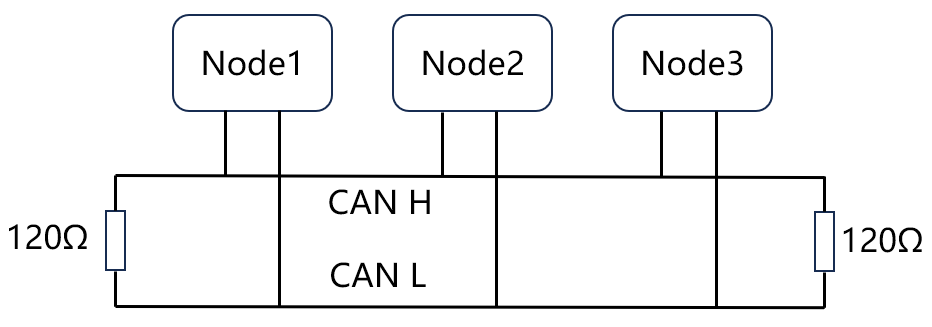

CAN通信
=========
.. contents:: 目录

CAN通信
----------
CAN通信，是一种通信方式，一般用于车辆、电机等的控制系统。大概原理是通过高、低两根CAN线形成电位差，表示逻辑1和逻辑0，通过以一定频率发送二进制数据表示要发送的数据信息。

CAN通信代码实现
----------------
CAN通信发送数据函数
~~~~~~~~~~~~~~~~~~~~~
.. code:: c

    /***********************************************
    函数功能：CAN发送数据
    入口参数：
                _hcan	can1 can2
                ide：	0：标准帧
                        1：扩展帧
                id：	帧ID
                len：	数据长度
                data：	数据
    返回值：0：成功。1：失败
    ************************************************/
    uint8_t CAN_SendMsg(CAN_HandleTypeDef* hcan,uint8_t ide,uint32_t id,uint8_t len,uint8_t *data)
    {
        uint32_t   TxMailbox;
        CAN_TxHeaderTypeDef CAN_TxHeader;
        HAL_StatusTypeDef   HAL_RetVal;
        uint16_t i=0;
        if(ide == 0) {
            CAN_TxHeader.IDE = CAN_ID_STD;	//标准帧
            CAN_TxHeader.StdId = id;
        }
        else {
            CAN_TxHeader.IDE = CAN_ID_EXT;			//扩展帧
            CAN_TxHeader.ExtId = id;
        }
        CAN_TxHeader.DLC = len;
        CAN_TxHeader.RTR = CAN_RTR_DATA;//数据帧,CAN_RTR_REMOTE遥控帧
        CAN_TxHeader.TransmitGlobalTime = DISABLE;
        while(HAL_CAN_GetTxMailboxesFreeLevel(hcan) == 0) {
            i++;
            if(i>0xfffe)
                return 1;
        }
        HAL_RetVal = HAL_CAN_AddTxMessage(hcan,&CAN_TxHeader,data,&TxMailbox);
        if(HAL_RetVal != HAL_OK) {
            return 1;
        }
        return 0;
    }

CAN通信接收数据函数
~~~~~~~~~~~~~~~~~~~~
.. code:: c

    /***********************************************
    函数功能：CAN接收数据
    入口参数：
                _hcan	can1 can2
                ide：	0：标准帧
                        1：扩展帧
                id：	帧ID
                len：	数据长度
                data：	数据
    返回值：0：成功。1：失败
    ************************************************/
    void HAL_CAN_RxFifo0MsgPendingCallback(CAN_HandleTypeDef *hcan)
    {
        HAL_StatusTypeDef		HAL_RetVal;	// 接受状态
        CAN_RxHeaderTypeDef     RxMeg;		// 接受报文结构体
        uint8_t					rx_data[8];	// 存储接收到的数据
        uint8_t 				id;			// 临时记录id
        /* CAN1 回调*/
        if(hcan->Instance == CAN1)
        {
            // C板接收消息
            HAL_RetVal=HAL_CAN_GetRxMessage(&hcan1, CAN_RX_FIFO0, &RxMeg,  rx_data);
            if ( HAL_OK==HAL_RetVal)
            {
                /* 底盘 M3508的反馈信息处理 */
                if(RxMeg.StdId >= CAN1_M2006_ID1 && RxMeg.StdId <= CAN1_M2006_ID2)	/* 0x201 ~ 0x204*/
                {
                    CAN1_CNT ++;
                    id = RxMeg.StdId-CAN1_M2006_ID1;
                    // 将数据保存在结构体中
                    CAN_M2006[id].angle=(rx_data[0]<<8)+rx_data[1];
                    CAN_M2006[id].speed=(rx_data[2]<<8)+rx_data[3];
                    CAN_M2006[id].current=(rx_data[4]<<8)+rx_data[5];
                    CAN_M2006[id].temperature=(rx_data[6]<<8);
                                get_total_angle_2006(&CAN_M2006[id]);
                }
                            
                if(RxMeg.StdId >= CAN1_M2006_ID3 && RxMeg.StdId <= CAN1_M2006_ID4)	/* 0x201 ~ 0x204*/
                {
                    CAN1_CNT ++;
                    id = RxMeg.StdId-0x203+8;
                    // 将数据保存在结构体中
                    CAN_M2006[id].angle=(rx_data[0]<<8)+rx_data[1];
                    CAN_M2006[id].speed=(rx_data[2]<<8)+rx_data[3];
                    CAN_M2006[id].current=(rx_data[4]<<8)+rx_data[5];
                    CAN_M2006[id].temperature=(rx_data[6]<<8);
                                get_total_angle_2006(&CAN_M2006[id]);
                }	
                            if(RxMeg.StdId==0x224)
                            {
                                CAN1_CNT++;
                                Z_position=(int16_t)((rx_data[0]<<8)+rx_data[1]);
                            }
                            
                if (CAN1_CNT == 500)
                {
                    CAN1_CNT = 0;
                }
            }
        }
        if(hcan->Instance == CAN2)
        {
            // 接收消息
            HAL_RetVal=HAL_CAN_GetRxMessage(&hcan2,  CAN_RX_FIFO0, &RxMeg,  rx_data);
            if ( HAL_OK==HAL_RetVal)
            {
                if(RxMeg.StdId >= CAN2_M2006_ID1 && RxMeg.StdId <= CAN2_M2006_ID2)	/* 0x201 ~ 0x204*/
                {
                    CAN2_CNT ++;
                    id = RxMeg.StdId-0x201+4;
                    // 将数据保存在结构体中
                    CAN_M2006[id].angle=(rx_data[0]<<8)+rx_data[1];
                    CAN_M2006[id].speed=(rx_data[2]<<8)+rx_data[3];
                    CAN_M2006[id].current=(rx_data[4]<<8)+rx_data[5];
                    CAN_M2006[id].temperature=(rx_data[6]<<8);
                                get_total_angle_2006(&CAN_M2006[id]);
                }					
                if(RxMeg.StdId >= CAN2_M2006_ID3 && RxMeg.StdId <= CAN2_M2006_ID4)	/* 0x201 ~ 0x204*/
                {
                    CAN2_CNT ++;
                    id = RxMeg.StdId-0x203+6;
                    // 将数据保存在结构体中
                    CAN_M2006[id].angle=(rx_data[0]<<8)+rx_data[1];
                    CAN_M2006[id].speed=(rx_data[2]<<8)+rx_data[3];
                    CAN_M2006[id].current=(rx_data[4]<<8)+rx_data[5];
                    CAN_M2006[id].temperature=(rx_data[6]<<8);
                                get_total_angle_2006(&CAN_M2006[id]);
                }
                if(RxMeg.StdId >= CAN2_M2006_ID5 && RxMeg.StdId <= CAN2_M2006_ID6)	/* 0x201 ~ 0x204*/
                {
                    CAN2_CNT ++;
                    id = RxMeg.StdId-0x205+2;
                    // 将数据保存在结构体中
                    CAN_M2006[id].angle=(rx_data[0]<<8)+rx_data[1];
                    CAN_M2006[id].speed=(rx_data[2]<<8)+rx_data[3];
                    CAN_M2006[id].current=(rx_data[4]<<8)+rx_data[5];
                    CAN_M2006[id].temperature=(rx_data[6]<<8);
                                get_total_angle_2006(&CAN_M2006[id]);
                }	
                if(RxMeg.StdId == CAN2_M2006_ID7)	/* 0x201 ~ 0x204*/
                {
                    CAN2_CNT ++;
                    id = 10;
                    // 将数据保存在结构体中
                    CAN_M2006[id].angle=(rx_data[0]<<8)+rx_data[1];
                    CAN_M2006[id].speed=(rx_data[2]<<8)+rx_data[3];
                    CAN_M2006[id].current=(rx_data[4]<<8)+rx_data[5];
                    CAN_M2006[id].temperature=(rx_data[6]<<8);
                                get_total_angle_2006(&CAN_M2006[id]);
                }	
                if (CAN2_CNT == 500)
                {
                    CAN2_CNT = 0;
                }
            }
        }
    }