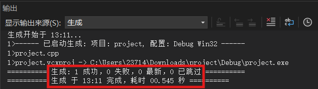
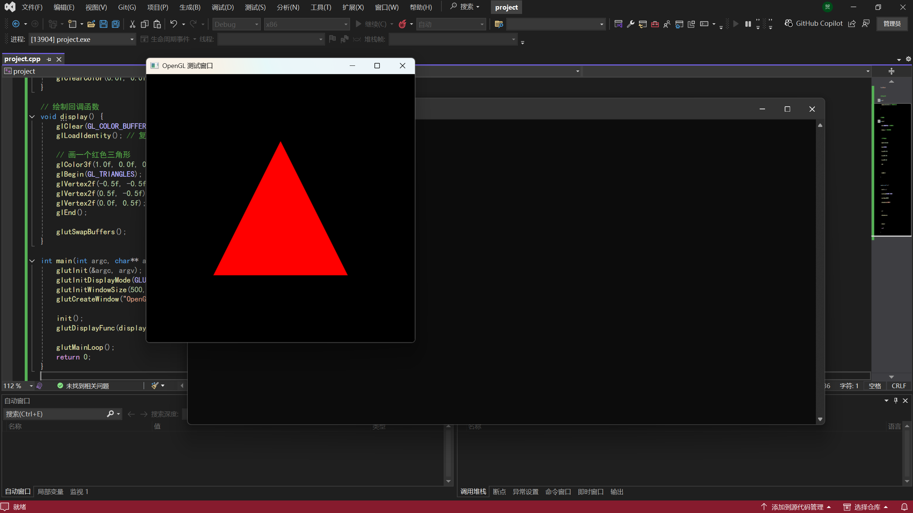
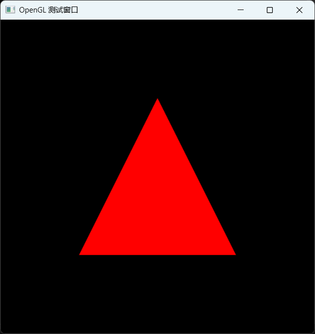
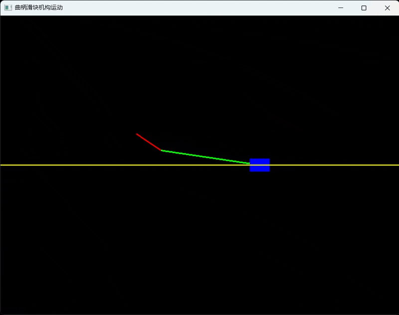

OpenGL
==========
.. contents:: 目录

OpenGL
---------
OpenGL，是用于绘制二维、三维图形的C语言程序语法。

OpenGL开发环境配置
-------------------
下面介绍如何在 **Visual Studio** 中配置OpenGL开发环境。

资源包下载
~~~~~~~~~~
下载链接📁：https://pan.baidu.com/s/182VEvjB5gp5vZRFOsXmkTw?pwd=0000

资源包内包含三个文件，将在后面的配置中用到。

- glut.h（头文件）
- glut32.dll（动态链接库）
- glut32.lib（库文件）
    
配置方法
~~~~~~~~~
1、找到Visual Studio的安装目录，比如下面是我的安装位置。

.. code:: bash

    "D:\FileData\VS2022"

.. note::

    Visual Studio默认目录🔗："C:/Program Files (x86)/Microsoft Visual Studio/2022"

2、头文件：glut.h拷贝到目录。

.. code:: bash
    
    "D:\FileData\VS2022\Community\VC\Tools\MSVC\14.27.29110\include\GL"
    "D:\FileData\VS2022\Profession\VC\Tools\MSVC\14.27.29110\include\GL"

.. note::

    自己新建一个叫 **GL** 的文件夹，然后把 **glut.h** 放进去。
    
3、动态链接库：glut32.dll拷贝到目录。

.. code:: bash
    
    "C:\Windows\SysWOW64"
    "C:\Windows\System32"

4、库文件：glut32.lib拷贝到目录。

.. code:: bash
    
    "D:\FileData\VS2022\Community\VC\Tools\MSVC\14.27.29110\lib\x86"
    "D:\FileData\VS2022\Profession\VC\Tools\MSVC\14.27.29110\lib\x86"

5、新建工程，**开始使用** -> **创建新项目** -> **控制台应用（C++）** 。

.. figure:: ../images/OpenGL/OpenGL开发环境配置/1.png

6、配置新项目，**项目名称** -> **位置** -> **解决方案名称** -> **将解决方案和项目放在同一目录中(D)** 。

.. figure:: ../images/OpenGL/OpenGL开发环境配置/2.png

7、配置头文件，**配置属性** -> **C/C++** -> **常规** -> **附加包含目录** -> **编辑** -> **新行** -> **选择目录** 。

.. code:: bash
    
    "D:\FileData\VS2022\Community\VC\Tools\MSVC\14.27.29110\include\GL"
    "D:\FileData\VS2022\Profession\VC\Tools\MSVC\14.27.29110\include\GL"

.. figure:: ../images/OpenGL/OpenGL开发环境配置/3.png

8、配置库文件，**配置属性** -> **链接器** -> **输入** -> **附加依赖项** -> **编辑** -> **输入“glut32.lib”** 。

.. figure:: ../images/OpenGL/OpenGL开发环境配置/4.png

9、编写程序代码，在 **.cpp** 中输入下方的示例程序代码。

.. code:: c

    #include <GL/glut.h>

    // 初始化 OpenGL 设置
    void init() {
        glClearColor(0.0f, 0.0f, 0.0f, 1.0f); // 设置背景颜色（黑色）
    }

    // 绘制回调函数
    void display() {
        glClear(GL_COLOR_BUFFER_BIT); // 清除颜色缓冲区
        glLoadIdentity(); // 复位模型视图矩阵

        // 画一个红色三角形
        glColor3f(1.0f, 0.0f, 0.0f);
        glBegin(GL_TRIANGLES);
        glVertex2f(-0.5f, -0.5f);
        glVertex2f(0.5f, -0.5f);
        glVertex2f(0.0f, 0.5f);
        glEnd();

        glutSwapBuffers();
    }

    int main(int argc, char** argv) {
        glutInit(&argc, argv);
        glutInitDisplayMode(GLUT_DOUBLE | GLUT_RGB);
        glutInitWindowSize(500, 500);
        glutCreateWindow("OpenGL 测试窗口");

        init();
        glutDisplayFunc(display);

        glutMainLoop();
        return 0;
    }

10、生成解决方案，解决方案配置选择 **Debug** ，解决方案平台选择 **X86** ，点击 **菜单栏** -> **生成** -> **生成解决方案（Ctrl+Shift+B）**，输出显示 **“生成: 1 成功，0 失败，0 最新，0 已跳过”** 即成功。

11、运行程序，点击 **工具栏** -> **本地Windows调试器** ，看到如下运行结果，即成功。

OpenGL示例工程项目
-------------------
下载链接📁：https://pan.baidu.com/s/1jDAVce4VqDvLNf-hLC9Pbw?pwd=0000

project
~~~~~~~~

bike
~~~~~~~
.. figure:: images/OpenGL/OpenGL示例工程项目/2.gif

slider
~~~~~~~~~

