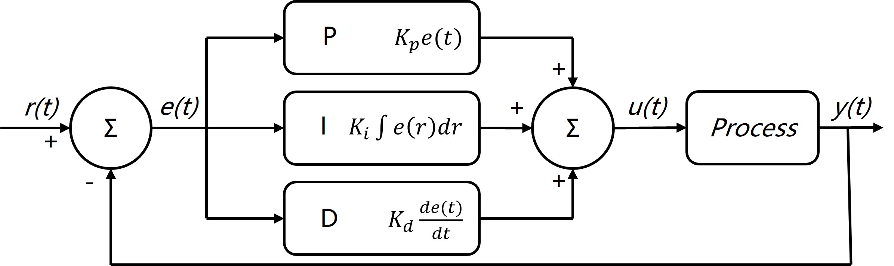

PID控制
========
.. contents:: 目录

PID控制
-----------
PID控制，是工业控制中最常用的控制算法之一。它通过对误差进行比例、积分和微分运算来实现对系统的控制。

PID控制概述
-------------
**P** 是比例， **I** 是积分， **D** 是微分。**r(t)** 是 **输入** ，**y(t)** 是 **输出** ，**e(t)** 是 **输入和输出的差** ，即 **e(t) = r(t) - y(t)** ，**u(t)** 是 **PID计算结果**。

将中间有关 **PID** 的计算看成一个 **“黑匣子”**，那么可以理解为，将 **这一次的r(t)** 和 **上一次的y(t)** 计算得到的 **这一次的e(t)** 扔到 **“黑匣子”** 中，获得 **这一次的u(t)** ， **这一次的u(t)** 在控制中形成了 **这一次的y(t)** 。

PID控制代码实现
-----------------
PID初始化函数
~~~~~~~~~~~~~~~~~~~~
.. code:: c

    /**
    * @brief  初始化PID结构体
    * @param  PID结构体指针
      @param  比例系数
      @param  积分系数
      @param  微分系数
      @param  积分最大值
      @param  总输出最大值 
    * @retval None
    */
    void PID_Init(
        PID_TypeDef*	    pid,
        uint32_t 			mode,
        uint32_t 			maxout,
        uint32_t 			intergral_limit,
        float 				kp,
        float 				ki,
        float 				kd,
        float I_Separation,float gama )
    {
        pid->max_iout = intergral_limit;
        pid->max_out = maxout;
        pid->mode = mode;

        pid->Kp = kp;
        pid->Ki = ki;
        pid->Kd = kd;
        pid->gama = gama;
        pid->Dbuf[0] = pid->Dbuf[1] = pid->Dbuf[2] = 0.0f;
        pid->error[0] = pid->error[1] = pid->error[2] = pid->Pout = pid->Iout = pid->Dout = pid->out = 0.0f;
        pid->I_Separation=I_Separation;
    }

PID计算函数
~~~~~~~~~~~~~~
.. code:: c

    /**
    * @brief  PID计算
    * @param  PID结构体指针
      @param  目标输入值
      @param  当前输出值
    * @retval None
    */
    float PID_Calculate(PID_TypeDef *pid, float set, float ref)
    {
        uint8_t index;
            if (pid == NULL)
        {
            return 0.0f;
        }

        pid->error[2] = pid->error[1];
        pid->error[1] = pid->error[0];
        pid->set = set;
        pid->fdb = ref;
        pid->error[0] = set - ref;
            if(fabs(pid->error[0]) > pid->I_Separation) //误差过大，采用积分分离
        {
            index = 0;
        }
        else
        {
            index = 1;
        }
        if (pid->mode == POSITION_PID)	 //位置式PID
        {
            pid->Pout = pid->Kp * pid->error[0];
            pid->Iout += pid->Ki * pid->error[0];		
            pid->Dbuf[2] = pid->Dbuf[1];
            pid->Dbuf[1] = pid->Dbuf[0];
            pid->Dbuf[0] = (pid->error[0] - pid->error[1]);
            pid->Dout = pid->Kd * (1 - pid-> gama) * (pid->Dbuf[0]) + pid-> gama * pid-> lastdout; //不完全微分
            abs_limit(&pid->Iout, pid->max_iout);
            pid->out = pid->Pout + index*pid->Iout + pid->Dout;
            abs_limit(&pid->out, pid->max_out);
        }
        else if (pid->mode ==DELTA_PID)	//增量式PID
        {
            pid->Pout = pid->Kp * (pid->error[0] - pid->error[1]);
            pid->Iout = pid->Ki * pid->error[0];
            pid->Dbuf[2] = pid->Dbuf[1];
            pid->Dbuf[1] = pid->Dbuf[0];
            pid->Dbuf[0] = (pid->error[0] - 2.0f * pid->error[1] + pid->error[2]);
            pid->Dout = pid->Kd * pid->Dbuf[0];
            pid->out += pid->Pout + pid->Iout + pid->Dout;
            abs_limit(&pid->out, pid->max_out);
        }
        return pid->out;
    }