Qt
======
.. contents:: 目录

Qt
----
Qt，是一个软件界面设计软件，本人所在教研室工业自动化设备软件开发的主要工具，其不仅支持编写基于多种语言的工程项目代码，还可开发可视化交互界面，同时Qt自带超多的库，方便直接引用，比如Qstring、Qmath等。

Qt下载
--------
Windows x64 下载📁：https://pan.baidu.com/s/1dH847AgJxrC_75hZAlVMpg?pwd=0000

Linux x64 下载📁：https://pan.baidu.com/s/1ZtyUpDWtpB0VtvjDf9folw?pwd=0000

Qt安装
--------
1、欢迎。

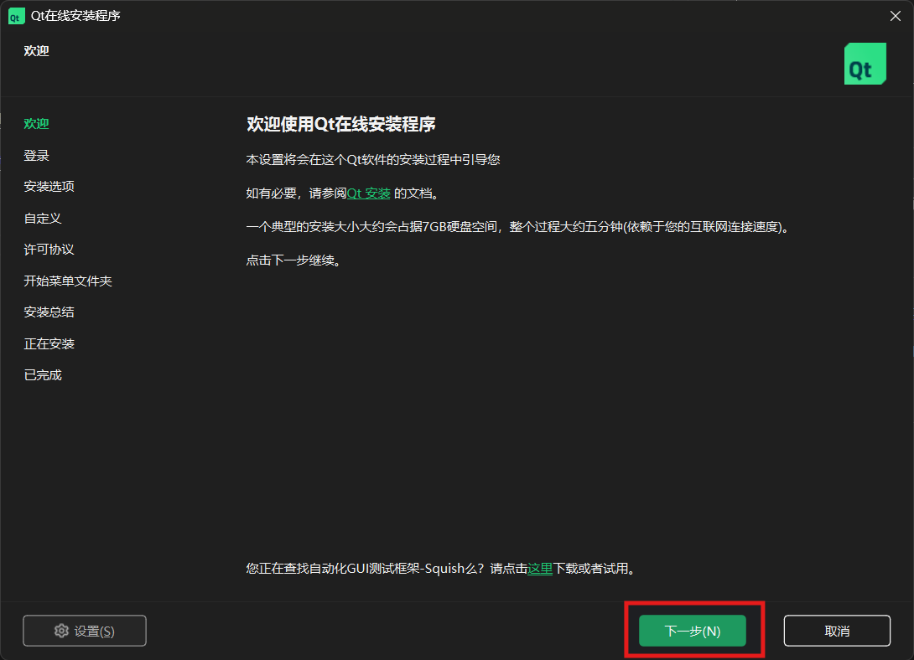

2、登录。

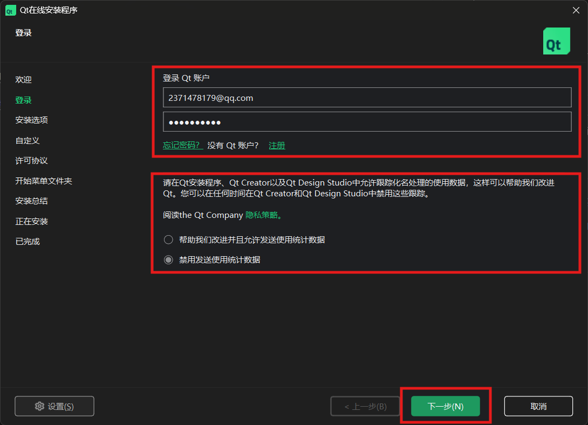

3、开源义务。

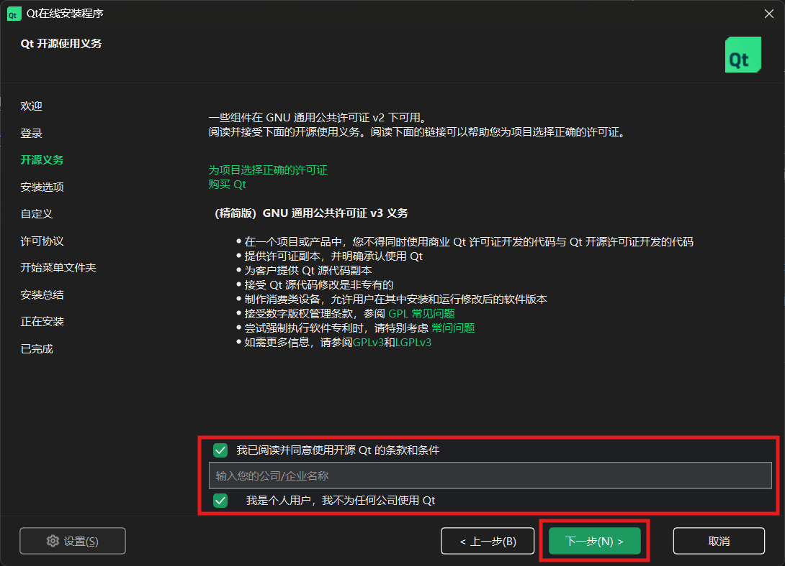

4、安装选项。

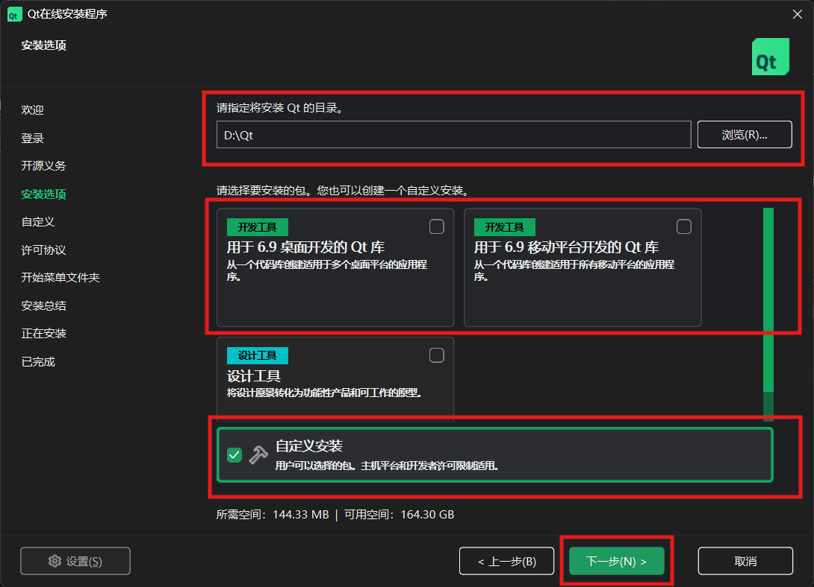

5、自定义。

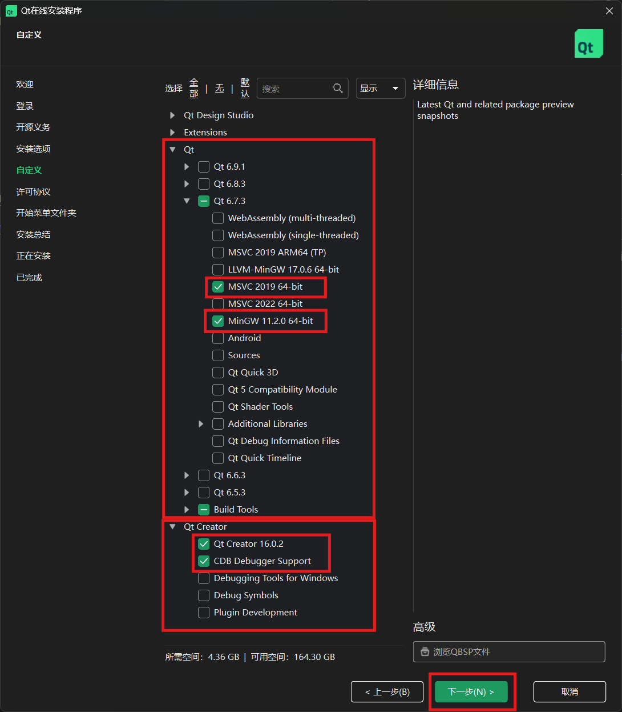

6、许可协议。

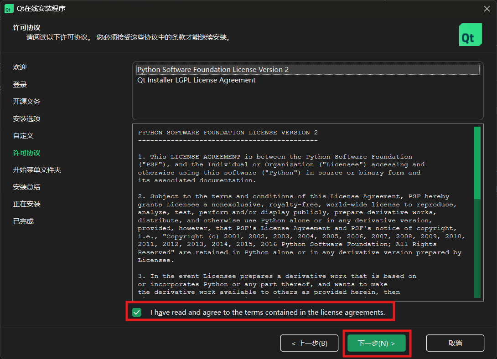

7、开始菜单文件夹。

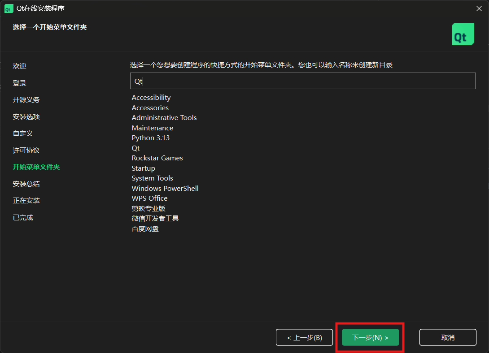

8、安装总结。

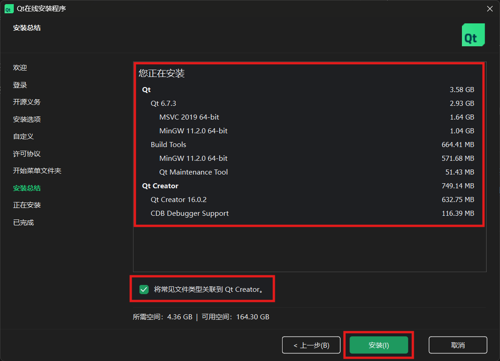

9、正在安装。

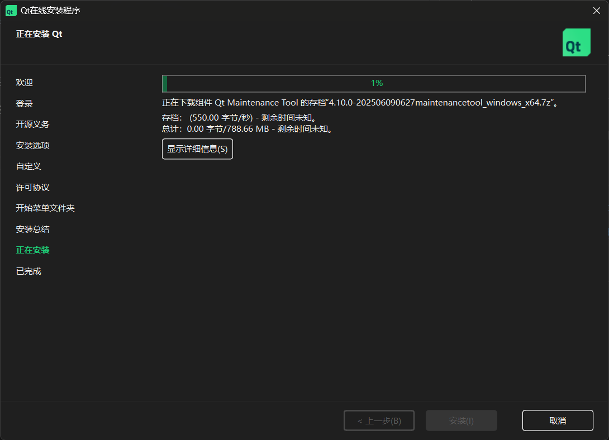

10、已完成。

.. note::

    1. **安装选项** 中推荐 **安装路径** 选为 **D盘** ，例如："D:\\Qt"
    2. **安装选项** 中推荐使用 **自定义安装** 的最简安装，其中包含了 **编辑** 、 **生成** 、 **调试** 等必备工具和插件。
    3. **正在安装** 中安装过程较为缓慢，需要耐心等待，连接 **科学上网工具** 速度相较会快些。

Qt新建项目
------------
1、创建项目。

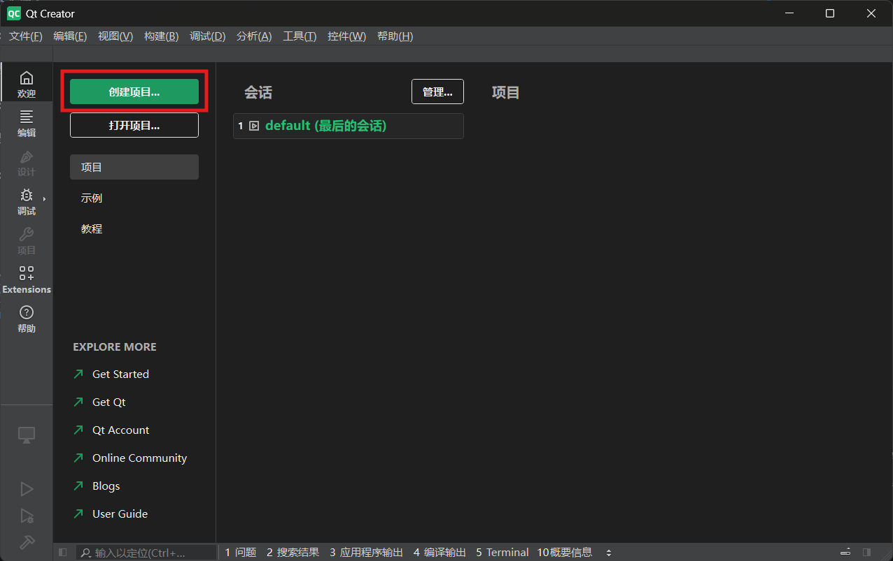

2、选择模板。

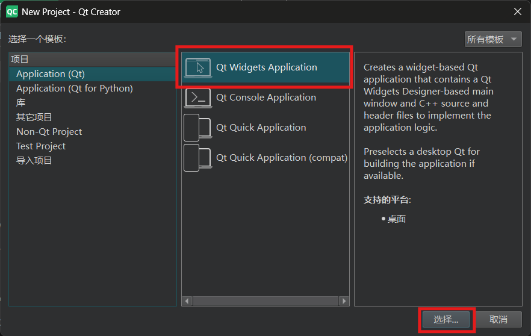

3、配置路径。

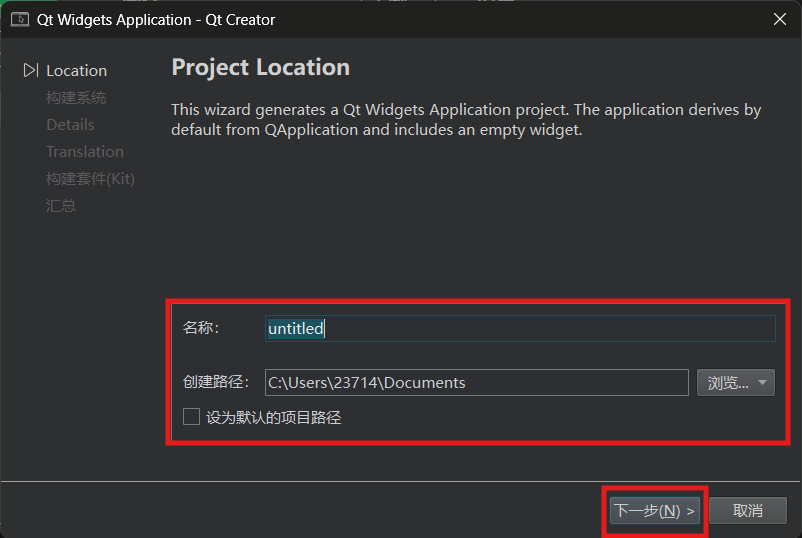

4、选择 **qmake** 构建系统。

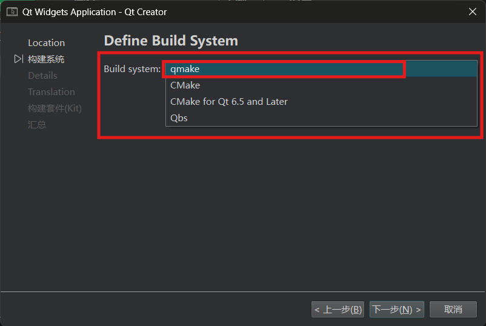

5、编辑 **类和文件** 信息。

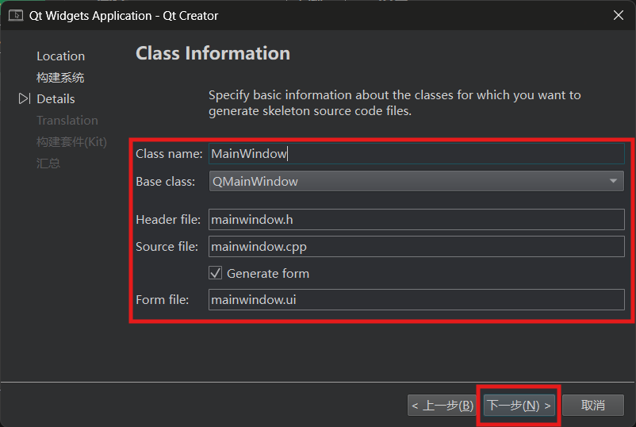

6、选择语言。

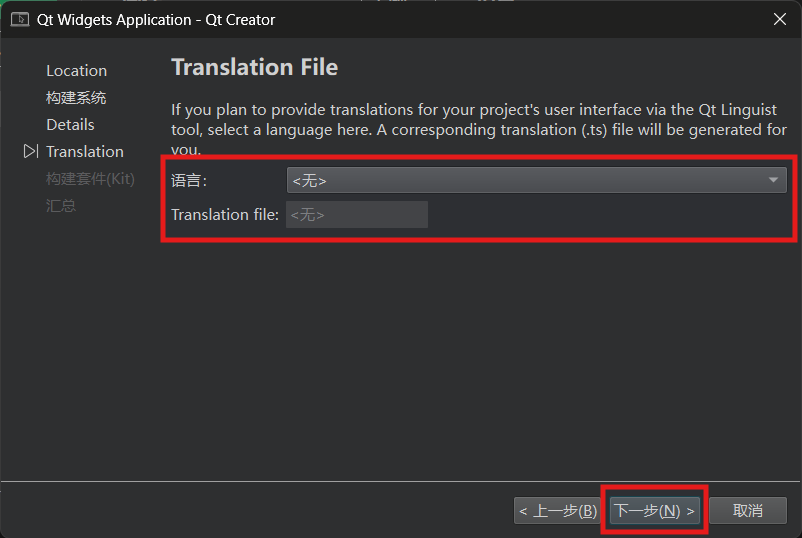

7、选择构建套件。

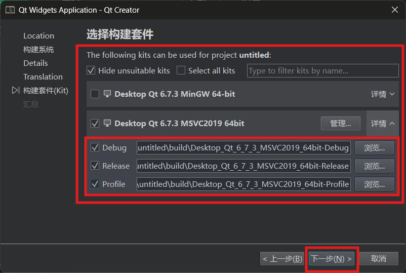

8、项目管理器

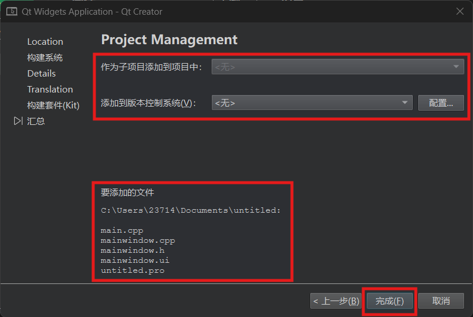

9、完成项目新建。

.. note::

    1. **选择构建套件** 中，教研室项目用的都是这个配置，MSVC2019 64bit。
    2. **选择构建系统** 中一定要选择 **qmake** ,默认是 **cmake** ，其需要额外安装 **cmake插件**。