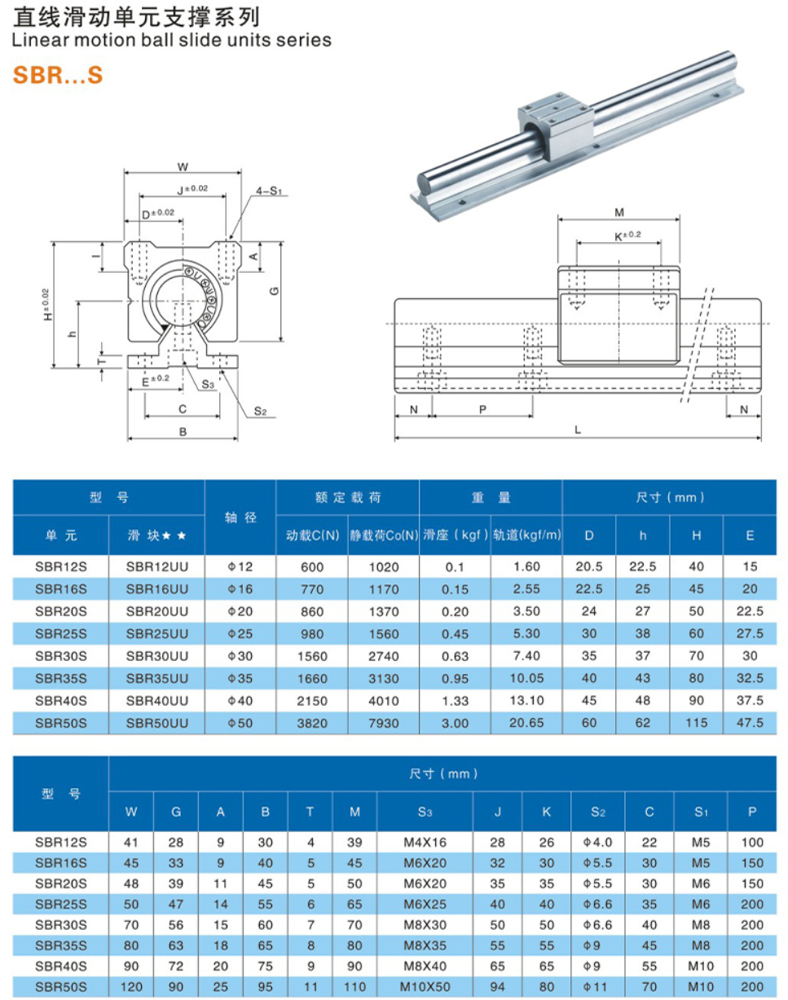

SBR直线导轨
===============
.. contents:: 目录

SBR直线导轨
------------
SBR直线导轨，是一种移动副标准零部件。这种直线导轨结合了光轴导轨和直线导轨的优势，采用连续长段的多个螺纹孔固定导轨。

SBR直线导轨选型
------------------
SBR直线导轨尺寸表
~~~~~~~~~~~~~~~~~~~~~

模型下载
~~~~~~~~~~~~
访问3Dfindit网站搜索MGN下载模型🔗：https://partsolutions.com/ecatalogsolutions/download-3d-cad-models/

下载SBR12S模型📁：https://pan.baidu.com/s/1DNS5kfhKq07OnnFp4LTXKw?pwd=0000
