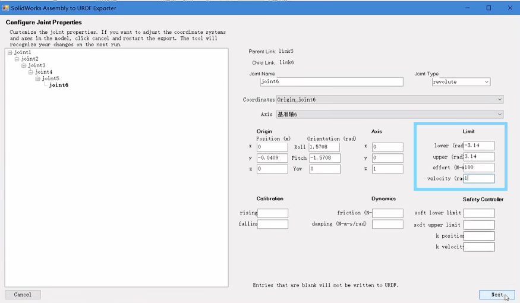

SW2URDF
=========
.. contents:: 目录

SW2URDF
---------
SW2URDF，是一个可以将SolidWorks模型转换为Urdf（通用机器人描述格式）的插件。

插件下载
---------
https://github.com/ros/solidworks_urdf_exporter/releases

如何使用SW2URDF
-----------------
这里推荐B站古月居老师的教程视频，讲的很清晰。

视频链接：https://www.bilibili.com/video/BV1Tx411o7rH/?share_source=copy_web&vd_source=c54bd55c82ff812550da113ebb229801

注意！！！

视频中角度、力、速度限制那部分要认真填，不然导出来的Urdf这部分参数是缺失的。小编之前导入转换好的Urdf文件到IsaacSim里面，因为前面偷懒没按照教程说的设置力和速度，导致IsaacSim中Urdf模型默认的速度和力是无穷大好像，仿真直接崩掉了，下图框出来的那部分。

