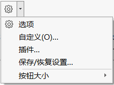
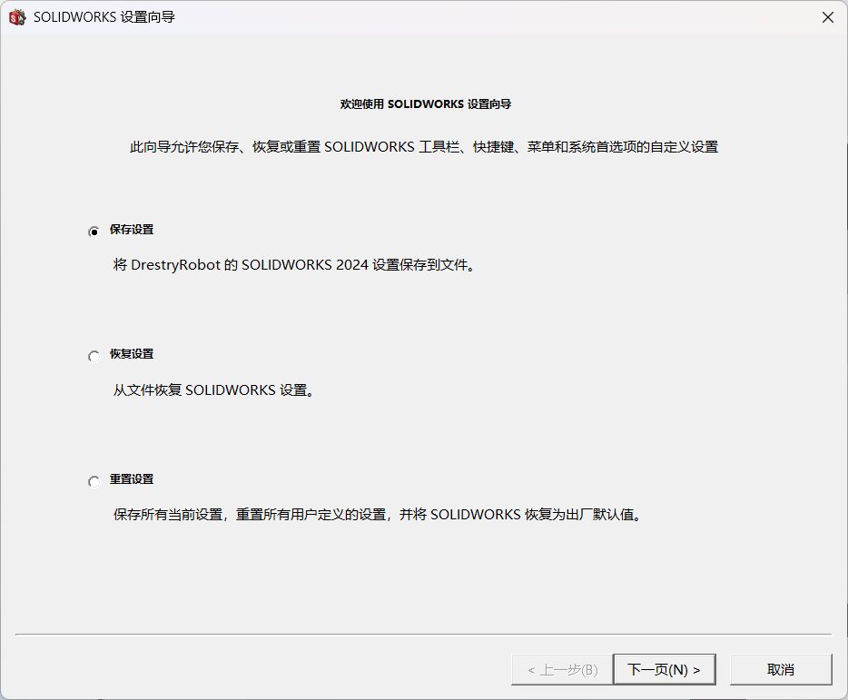
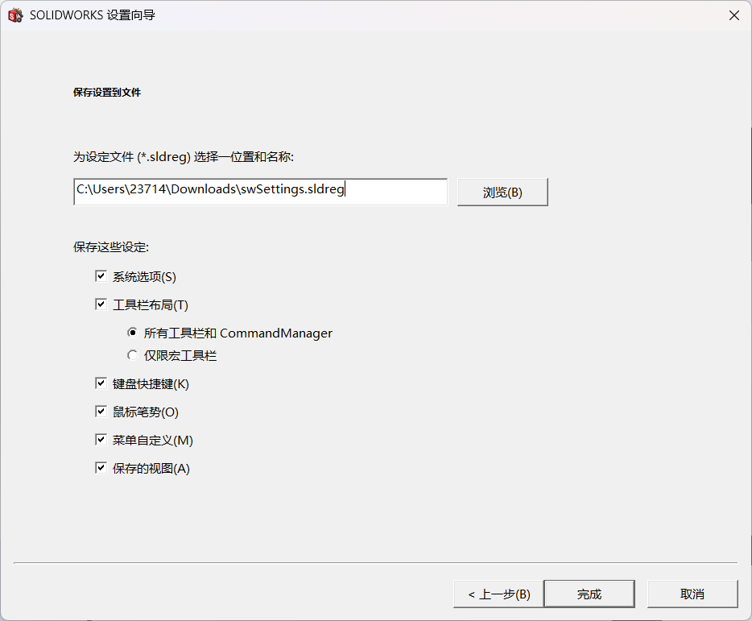
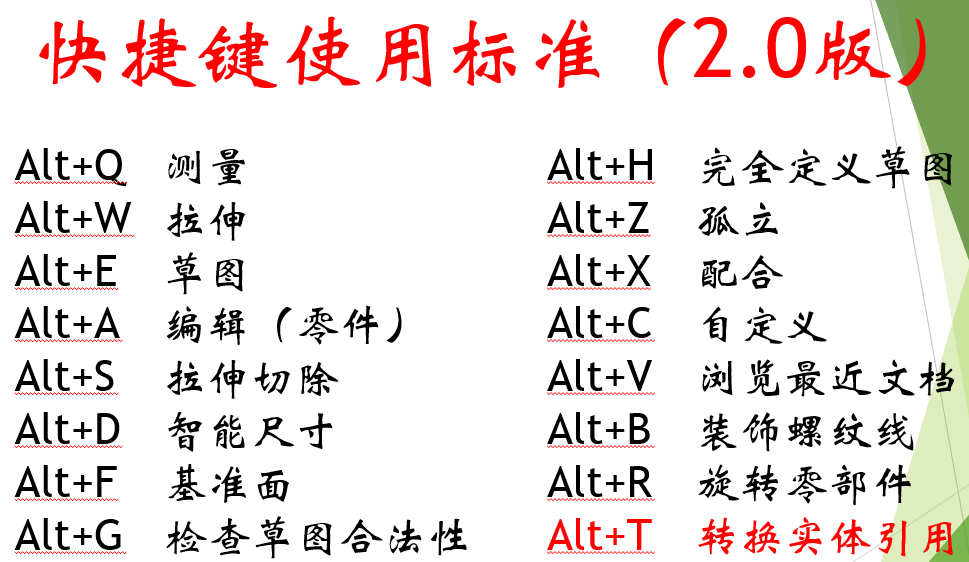
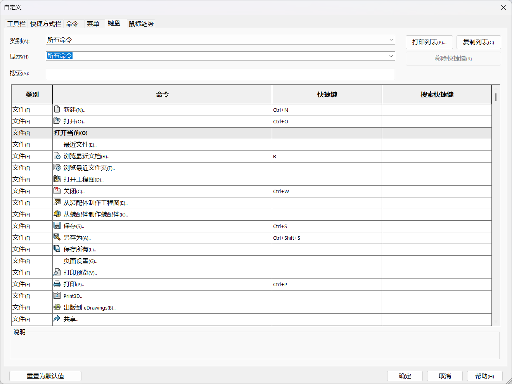

SolidWorks
==============
.. contents:: 目录

SolidWorks
-----------
SolidWorks，是一个工业建模软件，用于设计零件、装配体和工程图，操作简单，容易上手，功能齐全。

保存/恢复设置
-------------
SolidWorks中，有一个隐藏功能 **保存/恢复设置** 。

有啥用
~~~~~~~~~
这个功能最大的好处在于可以将自己的SW设置保存为本地配置文件，下次重新安装SW或者在其它设备上使用SW，直接通过本地配置文件进行恢复设置即可，省去重复配置设置的麻烦，方便迁移个人的自定义操作使用习惯。

使用方法
~~~~~~~~
1、点击 **设置按钮** 旁的下拉键即可找到 **保存/恢复设置** 功能按键。

2、打开后，有 **保存设置** 、 **恢复设置** 、 **重置设置** 等选项。

3、首次使用时，可以先点击 **保存设置** ，将设置保存到 **swSettings.sldreg** 文件。

4、重新安装SW或者需要在其它设备上使用SW时，可以通过 **恢复设置** 功能从 **swSettings.sldreg** 文件快速恢复设置。

SolidWorks基本操作
-------------------
1、按住 **Ctrl键** ，点击 **鼠标左键** ，可多选对象，或在草图 **智能尺寸** 标注时延伸对称尺寸。

2、按住 **Shift** ，点击 **鼠标左键** ，可在草图 **智能尺寸** 标注时选中圆或圆弧的外切边。

SolidWorks快捷键
-----------------
如何在SolidWorks中设置快捷键，下面分享一个 **快捷键标准** ，并介绍使用方法。

快捷键标准
~~~~~~~~~~~

使用方法
~~~~~~~~~
1、在上方 **菜单栏** 中打开 **工具/自定义/键盘** 。

2、**搜索** 对应的 **命令** 并设置 **快捷键** 。

