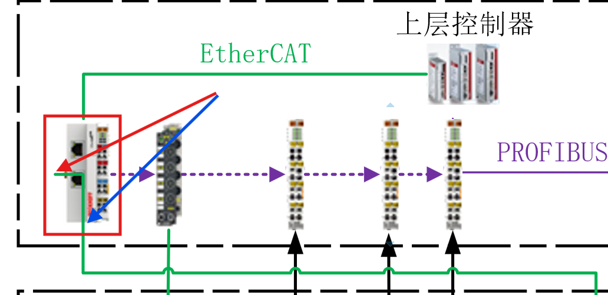
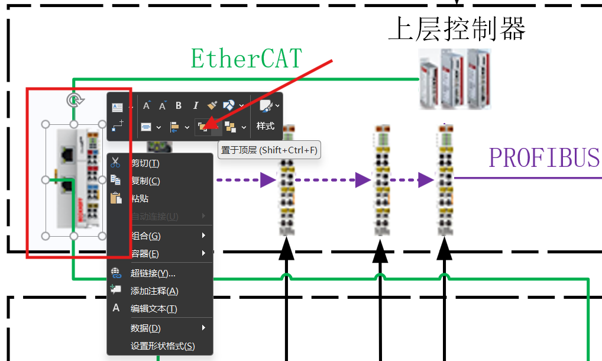
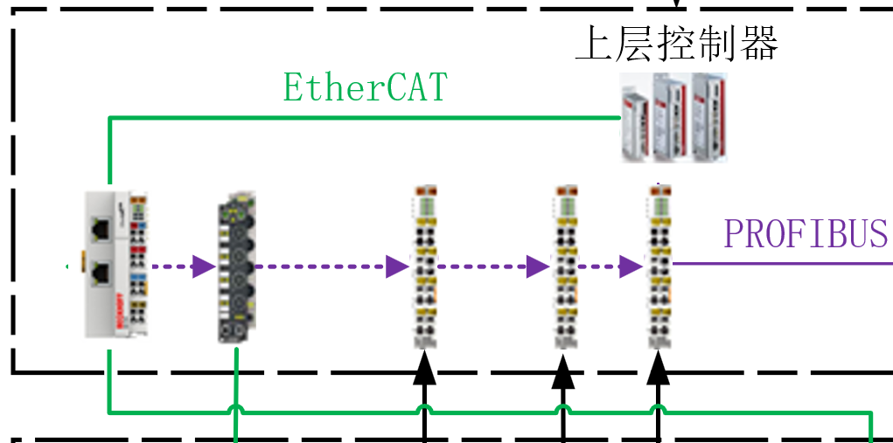

Visio
=======
.. contents:: 目录

Visio
-------
Visio，是微软Office办公软件中的图、表绘制软件，可用于绘制各种通用的专业的流程图，重点是可以插入Word文档，方便进行后续的修改，无需保存额外的流程图软件。

Visio使用
-----------
新建 **基本框图** 或者 **空白框图** ，这里推荐使用 **基本框图** 。

.. figure:: images/Visio/Visio使用/1.png

Visio安装
-----------------
下载和安装🔗：https://mp.weixin.qq.com/mp/appmsgalbum?__biz=MzA4MjU4MTg2Ng==&action=getalbum&album_id=3421491400485666822&scene=21#wechat_redirect

Visio连接线
------------------
Visio中画 **连接线** 时，软件自动选择 **连接点** ，无法精确定位到所需要连接的位置，如下图所示，软件自动选中 **红色箭头点** ，而实际所需要连接的位置是 **蓝色箭头点** 。

为了精确定位连接点，以正确表示流程图。可以 **拖动连接线** ，然后将图片 **置于顶层** 。

调整后，最终的 **连接线** 效果如下图所示。

