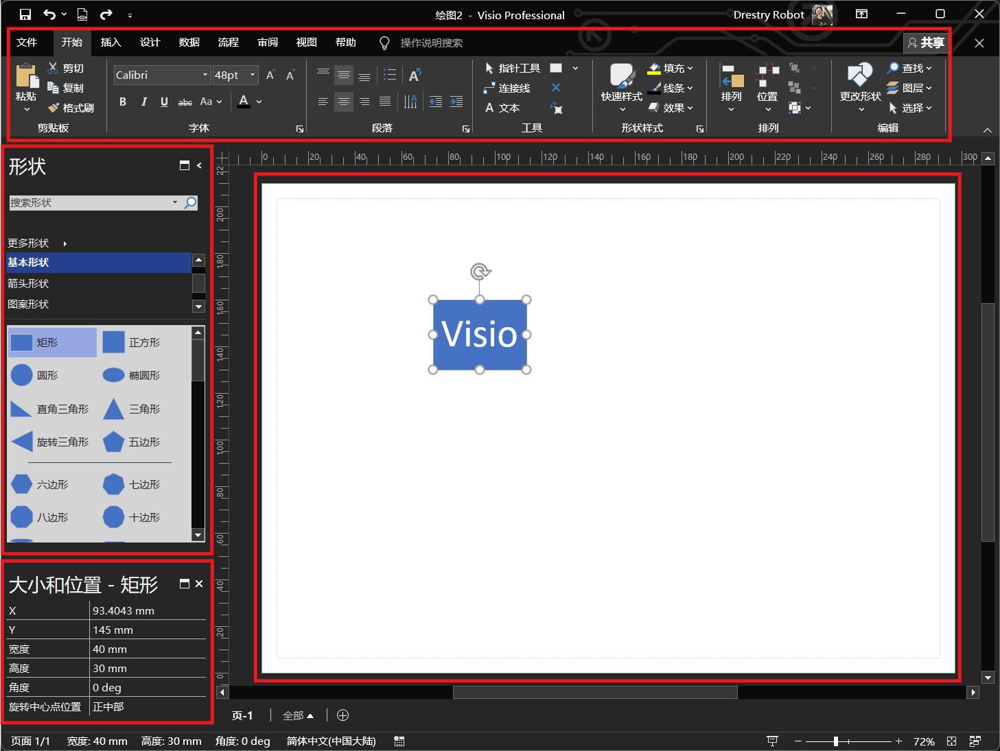

Visio
=======
.. contents:: 目录

Visio
-------
Visio，是微软Office办公软件中的图、表绘制软件，可用于绘制各种通用的专业的流程图，重点是可以插入Word文档，方便进行后续的修改，无需保存额外的流程图软件。

Visio使用
-----------
新建 **基本框图** 或者 **空白框图** ，这里推荐使用 **基本框图** 。

Visio安装
-----------------
下载和安装🔗：https://mp.weixin.qq.com/mp/appmsgalbum?__biz=MzA4MjU4MTg2Ng==&action=getalbum&album_id=3421491400485666822&scene=21#wechat_redirect
