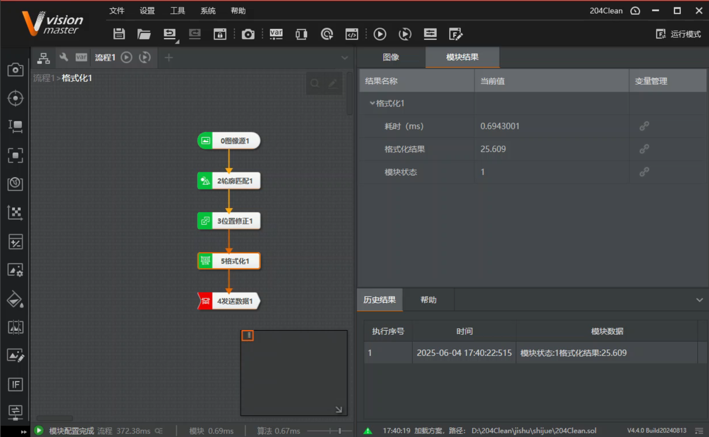

VisionMaster
=======================
.. contents:: 目录

VisionMaster
-------------
VisionMaster，是一个视觉算法软件，提供可视化流程界面，支持海康威视系列相机。不仅可以直接生成工程项目文件，向外发送数据，还支持二次开发，不通过VisionMaster去执行流程再发送数据给上位机程序，而是直接调用VisionMaster目录文件夹给的库和头文件，编写二次开发程序，实现利用程序执行流程并读取结果的功能。

UTF-8编码问题
---------------
报错信息
~~~~~~~~~~
.. warning::

    - D:\FileData\VisionMaster4.4.0\Development\V4.x\Includes\MVD_ErrorDefine.h:1: warning: C4828: 文件包含在偏移 0x8f 处开始的字符，该字符在当前源字符集中无效(代码页 65001)。

解决办法
~~~~~~~~~
使用 PowerShell 批量转换include文件夹内.c文件为UTF-8格式

打开 PowerShell（Win + R → 输入 powershell → 回车）。运行以下命令：

.. code:: bash

    Get-ChildItem -Path "D:\FileData\VisionMaster4.4.0\Development\V4.x\Includes" -Filter *.h | ForEach-Object {
    $content = Get-Content $_.FullName
    $content | Set-Content -Encoding UTF8 $_.FullName
    }

    Get-ChildItem -Path "D:\FileData\VisionMaster4.4.0\Development\V4.x\Includes" -Filter *.c | ForEach-Object {
        $content = Get-Content $_.FullName
        $content | Set-Content -Encoding UTF8 $_.FullName
    }

流程的三种执行方式
------------------

手动触发
~~~~~~~~~
上位机中打开VisionMaster流程界面，直接点击运行执行流程、获取结果、发送数据。

半软件触发
~~~~~~~~~~
上位机中打开VisionMaster流程界面，然后上位机执行程序，发送触发信号（一般为 1 ）到VisionMaster客户端，VM接收到软件触发信号后执行流程，获取结果，再原路返回发送给上位机执行程序。

全软件触发
~~~~~~~~~~~
无需打开VisonMaster流程界面，直接在上位机中运行程序，即可链接VM后台头文件和库文件，在后台执行流程、获取结果、发送数据。

二次开发示例代码
-----------------
官方手册给的二次开发流程执行示例代码。

.. code:: c++

    #include "IVmSolution.h"
    #include "IVmProcedure.h"
    #include "VMException.h"

    using namespace VisionMasterSDK;
    using namespace VisionMasterSDK::VmSolution;
    using namespace VisionMasterSDK::VmProcedure;

    int main(void)
    {
        try
        {
            //加载方案，仅支持绝对路径，编码格式UTF-8
            IVmSolution * pVmSol = LoadSolution("D:\\test.sol", "");
            if (NULL == pVmSol)
            {
                return IMVS_EC_NULL_PTR;
            }

            //使用流程名称获取流程对象
            IVmProcedure * pPrcObj = (IVmProcedure*)(*pVmSol)["流程1"];
            if (NULL == pPrcObj)
            {
                return IMVS_EC_NULL_PTR;
            }

            //获取流程所有模块信息
            ModuleInfoList * pModuList = pPrcObj->GetAllModuleList();

            //获取流程本层级模块信息，不包含Group内部模块
            ModuleInfoList * pModuListThisLayer = pPrcObj->GetProcedureModuleList();

            //禁用流程，禁用后流程不参与方案运行
            pPrcObj->DisableProcedure();

            //启用流程
            pPrcObj->EnableProcedure();

            //通过流程对象接口获取流程局部变量对象，用于设置/获取局部变量等
            CVariable * pVar = pPrcObj->GetLocalVariable();

            //通过流程对象接口获取流程参数对象，用于设置输入数据、设置/获取模块参数等
            IMVSProcedureParams *pParam = pPrcObj->GetParamObj();

            //通过流程参数对象接口设置输入数据
            //注意设置后输入数据仅当次执行有效，执行完成后清空，再次执行需再次设置
            unsigned char image[64 * 64] = { 0 };
            VisionMasterSDK::IoImage inputImage;
            ImageBaseData imageBaseData = { 0 };
            imageBaseData.Width = 64;
            imageBaseData.Height = 64;
            imageBaseData.DataLen = imageBaseData.Width * imageBaseData.Height;
            imageBaseData.Pixelformat = MVD_PIXEL_MONO_08;
            imageBaseData.ImageData = image;
            inputImage.stImage = imageBaseData;
            if (NULL != pParam)
            {
                pParam->SetInputImageV2("ImageData", &inputImage);
            }

            //流程同步执行一次
            pPrcObj->Run();

            //通过流程对象接口获取流程结果对象，用于获取流程输出
            //注意每次流程执行后，通过重新获取结果对象刷新其中输出数据
            //该操作存在耗时，建议获取结果对象后，直接使用对象获取具体输出数据
            IMVSProcedureResults *pRes = pPrcObj->GetResult();
            if (NULL != pRes)
            {
                IoImage outputImage = pRes->GetOutputImageV2("ImageData0");
            }

            //加载流程，仅支持绝对路径，编码格式UTF-8
            //注意非线程安全，不支持多线程调用
            IVmProcedure * pPrcObjByPath = LoadProcedure("D:\\testPrc.prc");
            if (NULL == pPrcObjByPath)
            {
                return IMVS_EC_NULL_PTR;
            }

            //设置连续执行时间间隔
            pPrcObjByPath->SetRunInterval(500);

            //流程开始连续执行
            pPrcObjByPath->Runing();

            //流程停止连续执行
            pPrcObjByPath->StopRun();

            //保存流程
            //注意非线程安全，不支持多线程调用
            pPrcObjByPath->SaveAsProcedure("D:\\testPrc.prc", "");

            //删除流程
            DestroyProcedureInstance(pPrcObjByPath);

            //退出程序前释放所有资源，注意避免在析构函数中调用
            DisposeResource();
        }
        catch (CVmException vmex)
        {
            return vmex.GetErrorCode();
        }
        catch (...)
        {
            return IMVS_EC_UNKNOWN;
        }

        return IMVS_EC_OK;
    }

二次开发成功代码
-----------------

有关byte的报错
----------------
报错信息
~~~~~~~~~~~~~
.. warning:: 

    - C:\Program Files (x86)\Windows Kits\10\Include\10.0.19041.0\shared\rpcndr.h:192: error: C2872: “byte”: 不明确的符号
    - C:\Program Files (x86)\Windows Kits\10\include\10.0.19041.0\shared\rpcndr.h(192): error C2872: “byte”: 不明确的符号
    - C:\Program Files (x86)\Windows Kits\10\include\10.0.19041.0\shared\rpcndr.h(191): note: 可能是“unsigned char byte”
    - C:\Program Files (x86)\Microsoft Visual Studio\2019\Professional\VC\Tools\MSVC\14.29.30133\include\cstddef(28): note: 或    “std::byte”

解决办法
~~~~~~~~~~~
双击索引至报错位置，注释第191行代码（或第192行），如果下次构建再次出现类似的报错，尝试取消第191行注释（或第192行）。

.. figure:: images/VisionMaster/有关byte的报错/1.png

相关资源资料下载
------------------
VisionMaster二次开发手册V4.4.1
~~~~~~~~~~~~~~~~~~~~~~~~~~~~~~~
https://pan.baidu.com/s/1sVOvvZ9EHKQk-sNFqpxERw?pwd=0000

VisionMaster_CN_STD_V4.3.0_241105
~~~~~~~~~~~~~~~~~~~~~~~~~~~~~~~~~~~~
https://pan.baidu.com/s/1U7p4hlfrr5zpBcEUYx9Pyw?pwd=0000

VisionMaster_CN_STD_V4.4.0_240813
~~~~~~~~~~~~~~~~~~~~~~~~~~~~~~~~~~~~~
https://pan.baidu.com/s/1RejOfjY663fzFHVMDiwkfw?pwd=0000

MVS_STD_4.4.0_240913
~~~~~~~~~~~~~~~~~~~~~~
https://pan.baidu.com/s/1JZ6PKcwnoTxoovVlpA-18A?pwd=0000

test.sol
~~~~~~~~~~
https://pan.baidu.com/s/1QR-p5qF4VE2JygdGGHaSjw?pwd=0000