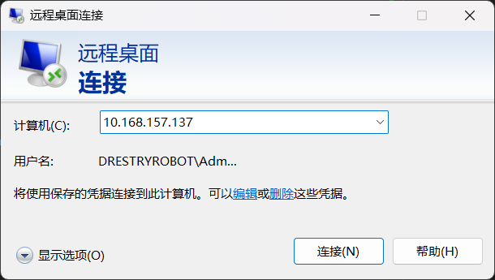

Windows
========
.. contents:: 目录

Windows
-----------
Windows，无需多言，本项目基于Windows开发。

Windows远程桌面
-------------------

被控端
~~~~~~~~~~
- 打开终端运行 **ipconfig**

- 找到并复制 **IPv4 地址**

- 确认计算机的 **用户名** 和 **用户密码**

主控端
~~~~~~~~~~~
- 搜索栏搜索 **RDP** 或 **远程桌面连接** 并打开

- 点击 **计算机(C)** ，输入刚刚复制的 **IPv4 地址**

- 点击 **显示选项** ，输入刚刚确认的 **用户名**

- 点击 **连接** ，在弹出的窗口中输入刚刚确认的 **用户密码**