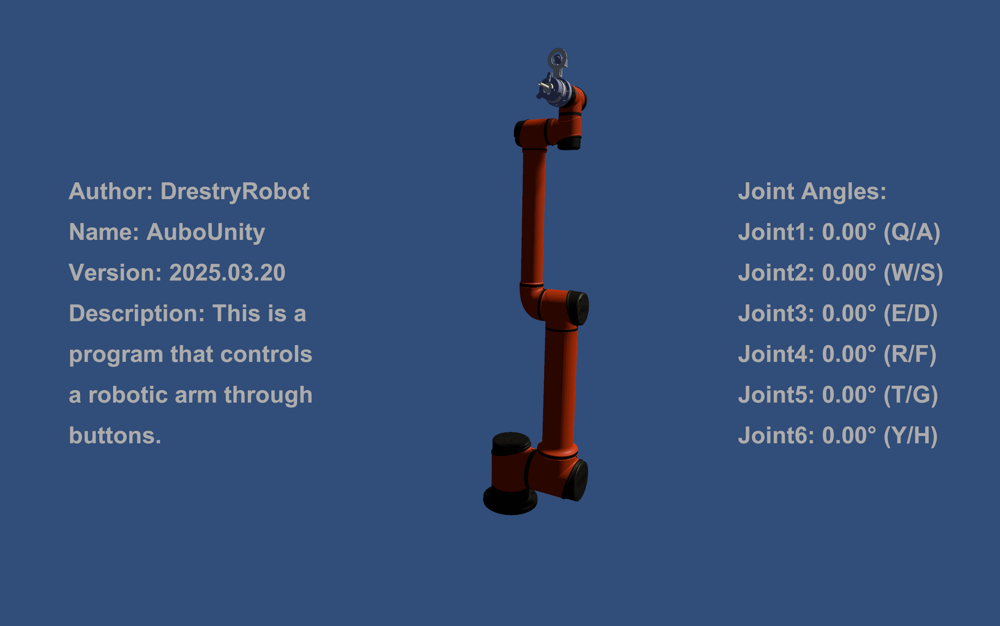

AuboUnity
==========
这是一个基于Unity平台搭建的Aubo机械臂仿真控制软件。

1. 项目简介
------------
由DrestryRobot利用Unity搭建的按键控制机械臂的仿真软件AuboUnity，欢迎下载体验。

2. 软件版本
------------
2025.03.20

3. 软件下载
------------
AuboUnity程序压缩包下载链接：https://pan.baidu.com/s/1gGPt4EnfnrD811BA6aqKTQ?pwd=0000

4. 文件内容
------------
- 文件1：AuboUnity.exe
- 文件2：UnityCrashHandler64.exe
- 文件3：UnityPlayer.dll
- 文件4：MonoBleedingEdge
- 文件5：AuboUnity_Data

5. 使用方法
------------
- AuboUnity程序压缩包下载并解压后，打开文件夹，双击``AuboUnity.exe``运行。
- 程序运行后，等待加载完成，按照右侧按键提示对仿真的机械臂关节进行控制。
- 推荐使用Alt+F4退出程序。

6. 按键操作
------------
- Joint1: Q键/A键
- Joint2: W键/S键
- Joint3: E键/D键
- Joint4: R键/F键
- Joint5: T键/G键
- Joint6: Y键/H键

7. 特别说明
------------
- 仅在windows上运行。
- 第一版，比较简陋。
- 后续有机会还会进一步优化。
- 相关后续请关注抖音@DrestryRobot。
- 存在一些问题，请谅解。
- 开发源于兴趣，仅作分享用途。

8. BUG解答
-----------
- 问题：Unity程序文件夹无法删除？
- 解决：重启电脑再删除即可。

- 问题：无法退出程序界面？
- 解决：目前软件比较简陋，请按Alt+F4退出程序。