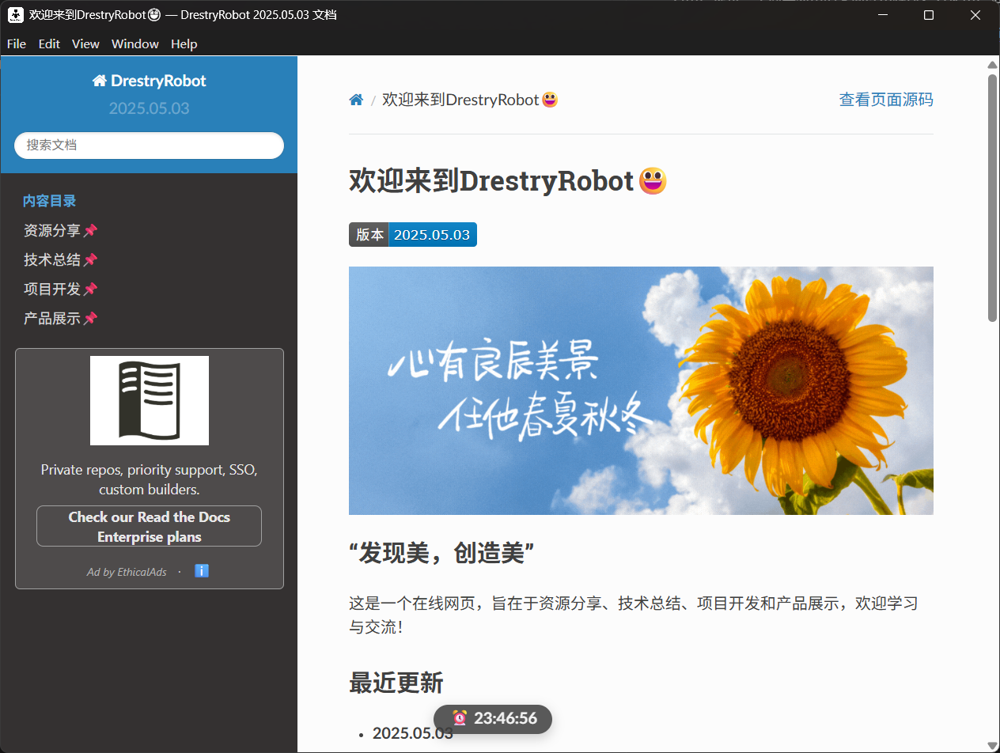
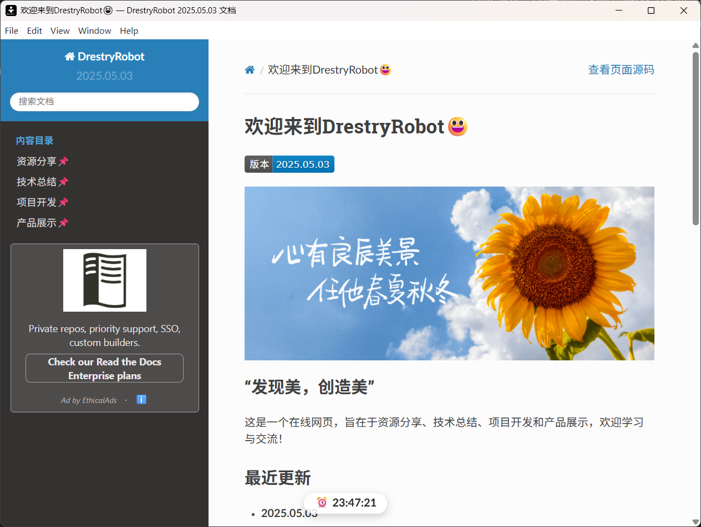

DrestryRobot
==============
DrestryRobot是一个基于Node.js开发的桌面应用程序，和DrestryRobot网页端保持一致的功能和设计。它是一个开源项目，旨在为用户提供一个简单易用的桌面应用程序，方便用户进行资源分享、技术总结、项目开发和产品展示。

界面设计
---------

   
   深色界面显示

   浅色界面显示

功能介绍
---------
-2025.05.03版本
    - 软件界面自动跟随系统深浅色模式进行切换
    - 软件图标自动跟随系统深浅色模式进行切换
    - 与网页端保持一致的功能和设计
    - 支持Windows操作系统

软件使用
---------
-2025.05.03版本
    - 下载软件压缩包后，解压缩到本地
    - 双击运行DrestryRobot.exe文件即可启动软件
    - 将DrestryRobot.exe固定至开始屏幕或任务栏，方便使用

BUG提醒
---------
-2025.05.03版本
    - 深色模式下软件界面仍为浅色
    - 初次启动软件时加载缓慢

下载地址
---------
点击此处下载：`DrestryRobot-win32-x64-2025.05.03.zip <https://pan.baidu.com/s/1aXDmUMYRZOYCcy6UzS6xkw?pwd=0000>`_

反馈建议
---------
如有任何问题或建议，请联系作者邮箱：2371478179@qq.com