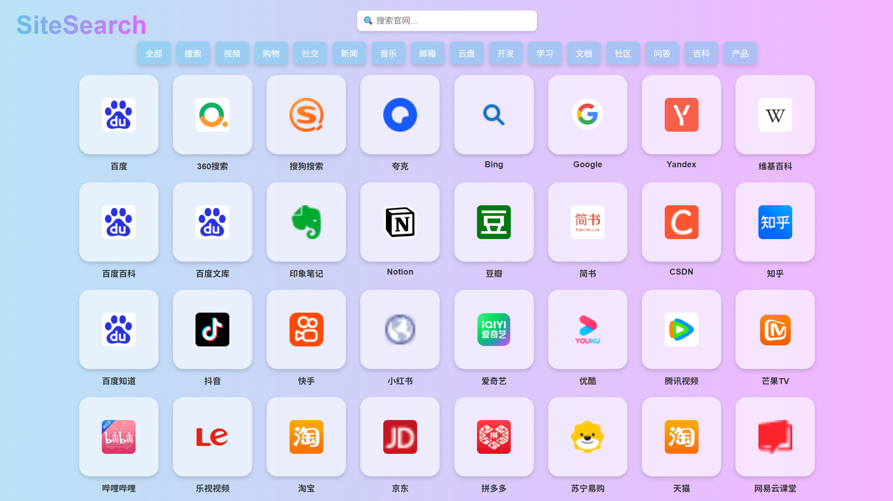

SiteSearch
===========
SiteSearch（官网导航）是一个方便用户快速检索、分类和访问常见的各大官方网站的导航网站。它提供了一个简洁明了的界面，用户可以通过点击不同的分类标签，快速找到所需的官方网站链接。

界面设计
---------

   界面显示

功能介绍
---------
- 2025.05.05
    - 优化界面UI设计
    - 新增和删减部分官网
- 2025.05.04
    - 集成了常见的各大官方网站，方便快速访问
    - 分类功能，可通过点击分类标签快速分类网站
    - 检索功能，可通过输入关键词快速检索所需网站

网页地址
---------
- 2025.05.04

    - 点击此处访问：`SiteSearch <https://drestryrobot.readthedocs.io/static/SiteSearch/index.html>`_

反馈建议
---------
如有任何问题或建议，请联系作者邮箱：2371478179@qq.com