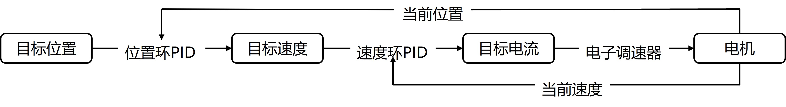

双环PID
========
.. contents:: 目录

双环PID
-----------
双环PID，是指在控制系统中使用两个PID控制器，一个用于内环控制，另一个用于外环控制。内环通常负责快速响应和精确跟踪，而外环则负责较慢的动态响应和系统稳定性。双环PID控制可以提高系统的性能和稳定性，适用于复杂的控制任务。

双环PID解读
-------------

设定电机 **目标位置** ，反馈获得电机 **当前位置** ，求差计算得到 **位置偏差** ，代入 **位置环PID** 计算得到 **目标速度** ，这一部分是 **位置环** ，即 **内环** 。

下一部分是 **速度环** ，即 **外环** 。反馈获得电机 **当前速度** ，与上一部分计算得到的 **目标速度** ，求差计算得到 **速度偏差** ，代入 **速度环PID** 计算得到 **目标电流** 。

最后一步是 **目标电流** 通过 **电子调速器** 驱动电机运转。

双环PID调参
-------------
.. code:: c

    /* 定义PID_Init() */
    void PID_Init(
    PID_TypeDef* pid,
    uint32_t mode,
    uint32_t maxout,
    uint32_t intergral_limit,
    float kp,
    float ki,
    float kd,
    float I_Separation,
    float gama )
    {
        pid->max_iout = intergral_limit;
        pid->max_out = maxout;
        pid->mode = mode;
        pid->Kp = kp;
        pid->Ki = ki;
        pid->Kd = kd;
        pid->gama = gama;
        pid->Dbuf[0] = pid->Dbuf[1] = pid->Dbuf[2] = 0.0f;
        pid->error[0] = pid->error[1] = pid->error[2] = pid->Pout = pid->Iout = pid->Dout = pid->out = 0.0f;
        pid->I_Separation=I_Separation;
    }

    /* PID初始化 */
    for (int i = 0; i < 2; i++) //横移
    {
        PID_Init(&PID_M2006[i], POSITION_PID, 16384, 1000,5, 0, 0, 500, 0);
        PID_Init(&PID_M2006_ANGLE[i], POSITION_PID,3000, 1000,100,0, 0, 500, 0);
    }
    for (int i = 2; i < 4; i++) //俯仰、横滚
    {
        PID_Init(&PID_M2006[i], POSITION_PID, 16384, 1000,5, 0, 0, 500, 0);
        PID_Init(&PID_M2006_ANGLE[i], POSITION_PID,3000, 1000,300,0, 0, 500, 0);
    }
    for (int i = 4; i < 6; i++) //前伸
    {
        PID_Init(&PID_M2006[i], POSITION_PID, 16384, 1000,5, 0, 0, 500, 0);
        PID_Init(&PID_M2006_ANGLE[i], POSITION_PID,8000, 1000,400,0, 0, 500, 0);
    }
    for (int i = 6; i < 8; i++) //偏航
    {
        PID_Init(&PID_M2006[i], POSITION_PID, 16384, 1000,5, 0, 0, 500, 0);
        PID_Init(&PID_M2006_ANGLE[i], POSITION_PID,3000, 1000,100,0, 0, 500, 0);
    }
    for (int i = 8; i < 10; i++) //转矿
    {
        PID_Init(&PID_M2006[i], POSITION_PID, 16384, 1000,5, 0, 0, 500, 0);
        PID_Init(&PID_M2006_ANGLE[i], POSITION_PID,8000, 1000,100,0, 0, 500, 0);
    }
    for (int i = 10; i < 11; i++) //存矿
    {
        PID_Init(&PID_M2006[i], POSITION_PID, 16384, 1000,5, 0, 0, 500, 0);
        PID_Init(&PID_M2006_ANGLE[i], POSITION_PID,14000, 1000,400,0, 0, 500, 0);
    }

以 **PID初始化** 代码为例讲解如何进行双环PID调参，示例代码中为多个功能用途各不相同的M2006直流无刷电机进行双环PID初始化。

.. code:: c

    PID_Init(&PID_M2006[i], POSITION_PID, 16384, 1000,5, 0, 0, 500, 0);

这是 **速度环** ，即 **外环** 的初始化代码。

.. code:: c

    PID_Init(&PID_M2006_ANGLE[i], POSITION_PID,3000, 1000,100,0, 0, 500, 0);

这是 **位置环** ，即 **内环** 的初始化代码。

.. code:: c

    void PID_Init(
    PID_TypeDef* pid,
    uint32_t mode,
    uint32_t maxout,
    uint32_t intergral_limit,
    float kp,
    float ki,
    float kd,
    float I_Separation,
    float gama );

参考 **PID_Init()** 定义，可以发现在初始化设置双环PID参数时，**速度环** 和 **位置环** 的 **ki** 、 **kd** 均为0，**位置环** 的 **kp** 比 **速度环** 的大很多，但是 **位置环** 的 **maxout** 却比 **速度环** 的小很多。

总结来说，双环PID调参的方法，根据我的实践经验来说，基本来说有以下几条。

.. tip::

    1. 先调位置环再调速度环。
    2. 先调kp，再调ki、kd。
    3. 最后要达到的效果是电机能快速稳定。