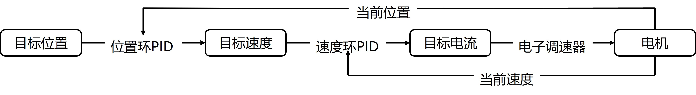

双环PID
========
.. contents:: 目录

双环PID
-----------
双环PID，是指在控制系统中使用两个PID控制器，一个用于内环控制，另一个用于外环控制。内环通常负责快速响应和精确跟踪，而外环则负责较慢的动态响应和系统稳定性。双环PID控制可以提高系统的性能和稳定性，适用于复杂的控制任务。

双环PID解读
-------------

设定电机 **目标位置** ，反馈获得电机 **当前位置** ，求差计算得到 **位置偏差** ，代入 **位置环PID** 计算得到 **目标速度** ，这一部分是 **位置环** ，即 **内环** 。

下一部分是 **速度环** ，即 **外环** 。反馈获得电机 **当前速度** ，与上一部分计算得到的 **目标速度** ，求差计算得到 **速度偏差** ，代入 **速度环PID** 计算得到 **目标电流** 。

最后一步是 **目标电流** 通过 **电子调速器** 驱动电机运转。

双环PID调参
-------------

