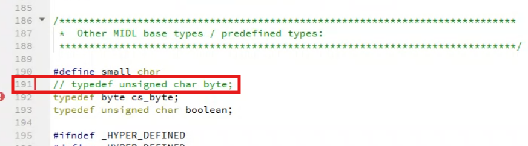

常用知识
=========

AUBO资源下载
-------------
官网链接🔗：https://www.aubo-robotics.cn/download

AUBO SCOPE 用户手册📄：https://www.aubo-robotics.cn/assets/aubo/download/ARCS/USER/AUBO_SCOPE_0_28-v1_0_1_20240328.pdf

AUBO SDK 使用手册📄：https://docs.aubo-robotics.cn/aubo_sdk_docs

AUBO SDK 接口手册📄：https://docs.aubo-robotics.cn/arcs_api/index.html

ARCS 软件相关基础知识📄：http://arcs.pages.aubo-robotics.cn:8001/arcs_wiki

Application Notes 应用笔记📄：https://docs.aubo-robotics.cn/application_notes

SDK应用开发包📁：https://pan.baidu.com/s/1jGRO-ckrEO520aIE502M-Q?pwd=0000

SDK应用开发包（新）📁：https://pan.baidu.com/s/1kJnkglZnfb6QmEYpNyHspQ?pwd=0000

AUBO PE 虚拟机📁：https://pan.baidu.com/s/1DLDqIQG23uu72WWAJD4Scw?pwd=0000

VisionMaster疑难解答
--------------------------
UTF-8编码问题
~~~~~~~~~~~~~~~
报错信息
^^^^^^^^^
.. warning::

    - C:/Program Files/VisionMaster4.2.0/Development/V4.x/Includes/MVD_ErrorDefine.h:1: warning: C4828: 文件包含在偏移 0x8f 处开始的字符，该字符在当前源字符集中无效(代码页 65001)。

解决办法
^^^^^^^^^
使用 PowerShell 批量转换include文件夹内.c文件为UTF-8格式

打开 PowerShell（Win + R → 输入 powershell → 回车）。运行以下命令：

.. code:: bash

    Get-ChildItem -Path "C:\Program Files\VisionMaster4.2.0\Development\V4.x\Includes" -Filter *.h | ForEach-Object {
    $content = Get-Content $_.FullName
    $content | Set-Content -Encoding UTF8 $_.FullName
    }

    Get-ChildItem -Path "C:\Program Files\VisionMaster4.2.0\Development\V4.x\Includes" -Filter *.c | ForEach-Object {
        $content = Get-Content $_.FullName
        $content | Set-Content -Encoding UTF8 $_.FullName
    }

有关byte的报错
~~~~~~~~~~~~~~~
报错信息
^^^^^^^^^
.. warning:: 

    - C:\Program Files (x86)\Windows Kits\10\Include\10.0.19041.0\shared\rpcndr.h:192: error: C2872: “byte”: 不明确的符号
    - C:\Program Files (x86)\Windows Kits\10\include\10.0.19041.0\shared\rpcndr.h(192): error C2872: “byte”: 不明确的符号
    - C:\Program Files (x86)\Windows Kits\10\include\10.0.19041.0\shared\rpcndr.h(191): note: 可能是“unsigned char byte”
    - C:\Program Files (x86)\Microsoft Visual Studio\2019\Professional\VC\Tools\MSVC\14.29.30133\include\cstddef(28): note: 或    “std::byte”

解决办法
^^^^^^^^^
双击索引至报错位置，注释第191行代码（或第192行），如果下次构建再次出现类似的报错，尝试取消第191行注释（或第192行）。

VisionMaster资源下载
----------------------
VisionMaster二次开发手册V4.4.1📄：https://pan.baidu.com/s/1sVOvvZ9EHKQk-sNFqpxERw?pwd=0000

VisionMaster_CN_STD_V4.3.0_241105📁：https://pan.baidu.com/s/1U7p4hlfrr5zpBcEUYx9Pyw?pwd=0000

VisionMaster_CN_STD_V4.4.0_240813📁：https://pan.baidu.com/s/1RejOfjY663fzFHVMDiwkfw?pwd=0000

MVS_STD_4.4.0_240913📁：https://pan.baidu.com/s/1JZ6PKcwnoTxoovVlpA-18A?pwd=0000

test.sol📁：https://pan.baidu.com/s/1QR-p5qF4VE2JygdGGHaSjw?pwd=0000

VisionMaster_CN_STD_V4.2.0（定制试用版3个月）📁：https://pan.baidu.com/s/17j3QiaQKOS8yNWvoJU2OeQ?pwd=0000

vm_test.zip📁： https://pan.baidu.com/s/1ybZCzPCCRyPKhP70dYC4QQ?pwd=0000

VM FAQ手册(V1.12).chm📁：https://pan.baidu.com/s/1W1zNLaI3mks9RXw5mpechw?pwd=0000