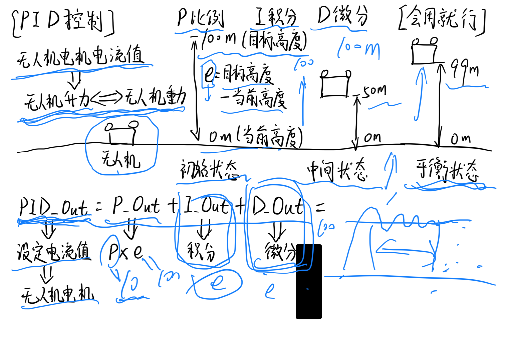

PID控制
========
.. contents:: 目录

PID控制
-----------
PID控制，是工业控制中最常用的控制算法之一。它通过对误差进行比例、积分和微分运算来实现对系统的控制。

技术总结
-----------

   PID控制
   
视频讲解
-----------
PID控制，通俗易懂讲法 https://v.douyin.com/iK9U6J89Rz8/