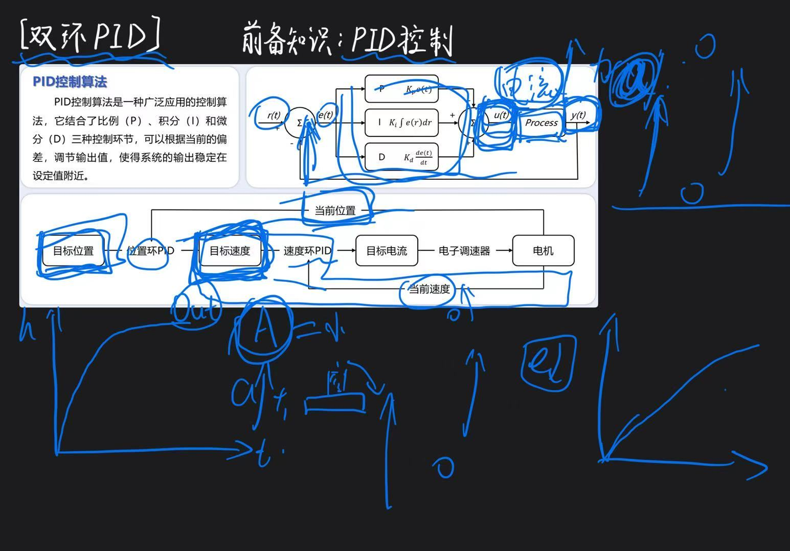

双环PID
========
.. contents:: 目录

1 理论知识
-----------
双环PID控制是指在控制系统中使用两个PID控制器，一个用于内环控制，另一个用于外环控制。内环通常负责快速响应和精确跟踪，而外环则负责较慢的动态响应和系统稳定性。双环PID控制可以提高系统的性能和稳定性，适用于复杂的控制任务。

2 技术总结
-----------

   双环PID
   
3 视频讲解
-----------
双环PID，提出一种看法哈 https://v.douyin.com/7Pl14HOv5i0/