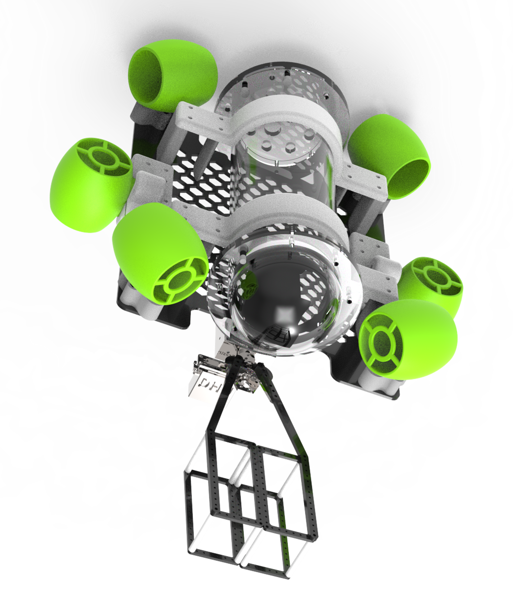
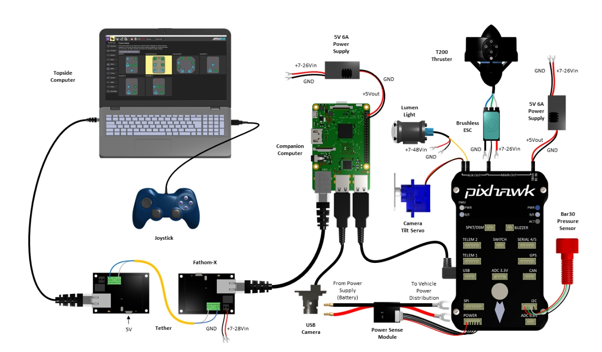

水下机器人
==========
版本：2025.04.18

1 机械
------
1.1 概述
~~~~~~~~
水下机器人由舱体、推进器、机械臂夹爪等部分组成。舱体是水下机器人的主体，推进器用于提供动力，机械臂夹爪用于抓取物体。水下机器人可以在水下进行各种任务，如探测、拍摄、抓取等。

1.2 模型
~~~~~~~~
水下机器人模型下载链接：https://pan.baidu.com/s/1ZIeMYyqml1nNkztljZFXuA?pwd=0000

1.3 图示
~~~~~~~~~

2 控制
------
2.1 概述
~~~~~~~~
水下机器人控制部分使用的是现成的控制组件，硬件采用树莓派、飞控等搭建，软件使用的QGroundControl。

2.2 硬件
~~~~~~~~~
硬件部分实物搭建采用的是树莓派3B+、PixHawk4飞控，具体参考下图即可。

2.3 软件
~~~~~~~~~
QGroundControl是一个开源的地面控制站软件，支持多种无人机和水下机器人。它提供了一个用户友好的界面，可以实时监控机器人的状态，并进行任务规划和控制。

**技术手册**：https://docs.qgroundcontrol.com/master/en/qgc-user-guide/

.. note::
   1. 如果对这套水下机器人搭建路线感兴趣，可以按照给的硬件连线图进行采购和搭建，配合QGroundControl进行软件开发控制。
   2. 这里的难点是QGroundControl软件的使用，具体可参考 `技术手册 <https://docs.qgroundcontrol.com/master/en/qgc-user-guide/>`_ 进行学习。