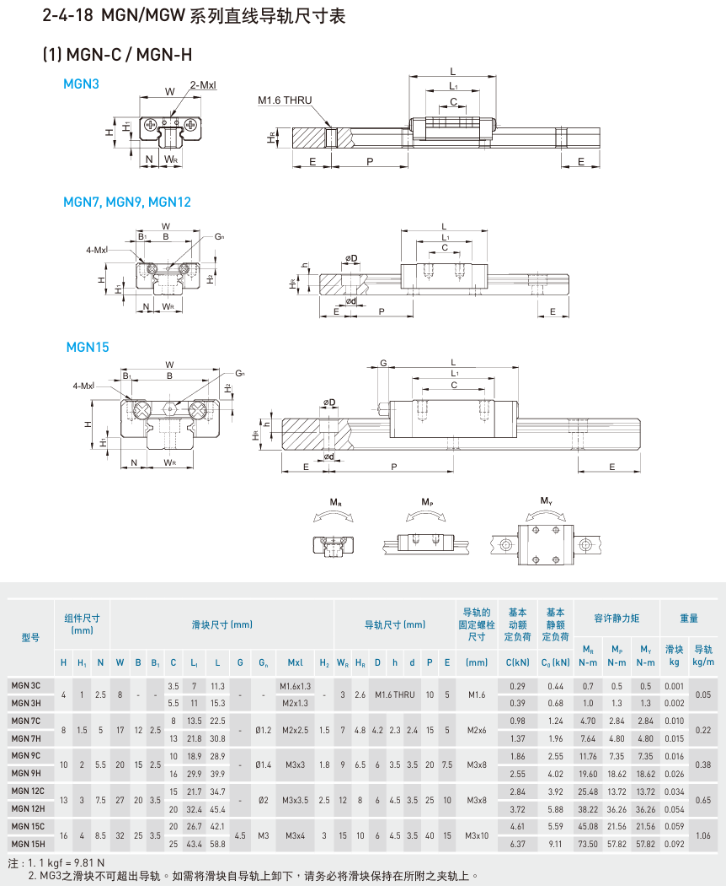

直线导轨
=========
.. contents:: 目录

直线导轨
---------
直线导轨，是一种移动副标准零部件。由导轨和滑块组成，滑块可按长度分为长型和短型，可按形状分为方型和法兰型。不知道如何选型的话，直接选MGN系列，根据负载质量选择对应规格的MGN系列型号即可。

直线导轨选型
-------------
常用的是MGN系列，所以此处以上银科技的MGN系列为例进行选型介绍。

官方技术文档🔗：https://www.hiwinsupport.com/download/tech_doc/gw/Linear_Guideway-(S).pdf

MGN系列直线导轨尺寸表
~~~~~~~~~~~~~~~~~~~~~~~~~

选型依据
~~~~~~~~~~
- 确定负载质量，选择对应负荷承载能力的导轨
- 确定负载尺寸大小规格，选择对应尺寸规格大小的滑块滑轨

模型下载
~~~~~~~~~~~~
访问3Dfindit网站搜索MGN下载模型：https://partsolutions.com/ecatalogsolutions/download-3d-cad-models/