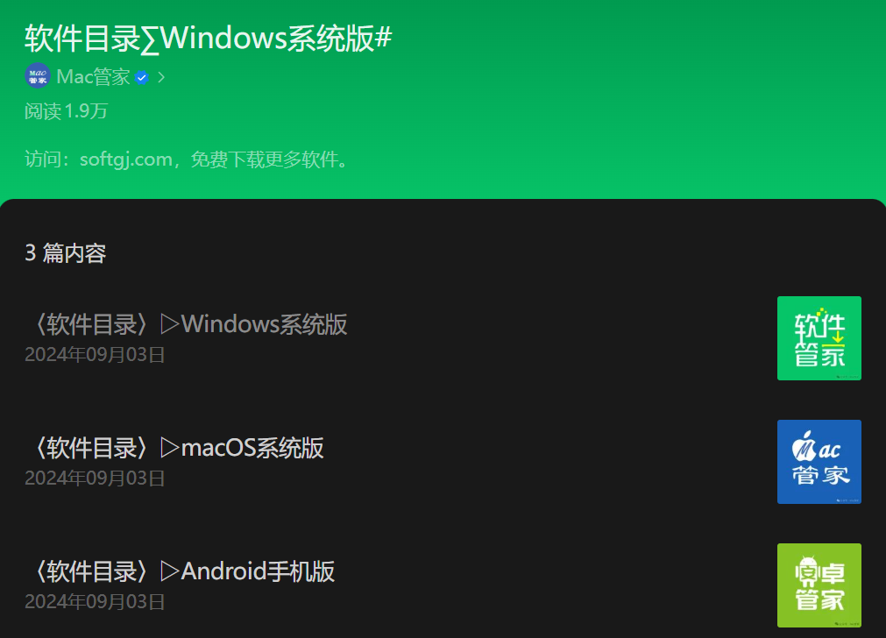

软件管家
=========
.. contents:: 目录

软件管家
----------
软件管家，是一个微信公众号，提供免费的各类软件工具资源下载，涵盖装机必备、电脑系统、办公软件、PDF编辑、文献工具、翻译软件、图像处理、媒体工具、AutoCAD、3D设计、机械设计、建筑设计、网页设计、开发编程、理科工具、仿真模拟、电子电路、行业软件等多个类别的软件安装资源。

界面介绍
--------

网页链接
-----------
网页链接：https://mp.weixin.qq.com/mp/appmsgalbum?__biz=Mzg5NTcwOTk1OQ==&action=getalbum&album_id=3619576313255591937#wechat_redirect

.. note::

   1. 源于第三方网站，仅作交流分享用途