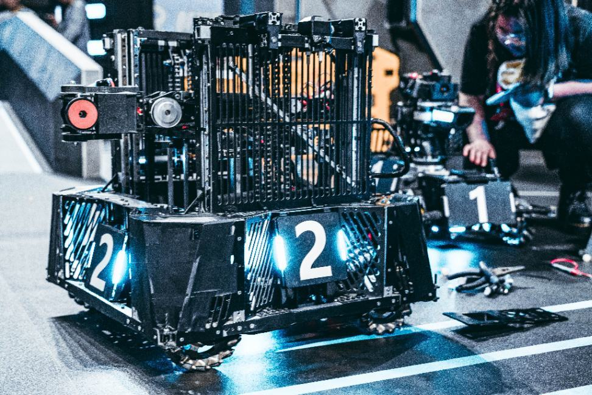
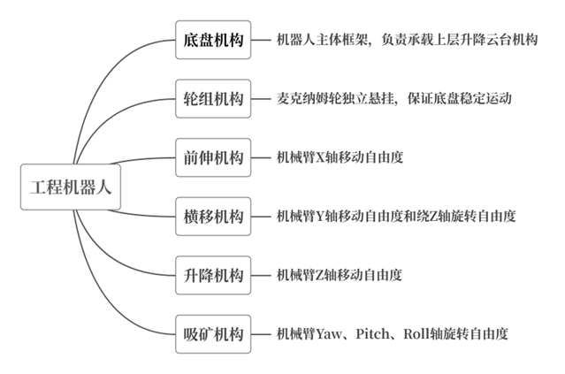
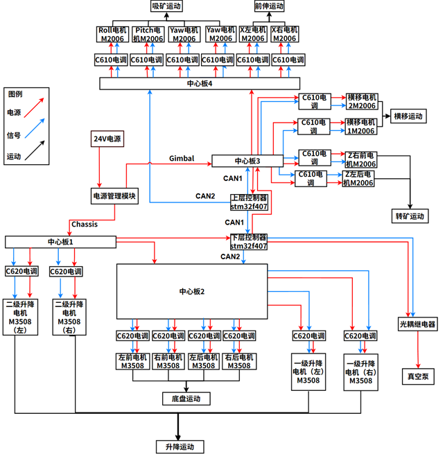

吸矿机器人
===========
.. contents:: 目录

吸矿机器人
------------
吸矿机器人，是RoboMaster机甲大师赛事中的工程机器人兵种。

技术方案
----------
机械设计
~~~~~~~~
根据2024赛季工程机器人的设计目标，我们需要增加云台机械臂部分的自由度，使其适应一至五级各级难度矿石兑换，但同时又需要结合传统构型，提升其对于固定场景如取金银矿、存取矿等的执行速度。结合设计要求，2024赛季工程机器人主要划分为底盘机构、轮组机构、前伸机构、横移机构、升降机构、吸矿机构等六大机构。其中，由前伸、横移、升降、吸矿等机构组成一个8自由度的机械臂。

控制系统
~~~~~~~~~
工程所需要控制的外设较多，其中底盘运动装置、机械臂装置、矿石储存装置等需要用到大量电机，同时还需要用到光电开关、多路继电器等需要IO口的设备模块。综合考虑线长、布线难度、电源、机械运动带来的影响等因素，我们选用了两块C板作为控制器，分别置于工程的上层空间以及下层空间，下层的C板控制底盘运动以及气缸的状态，上层的C板主要负责接收控制信号同时控制采矿装置，两块C板通过CAN通信进行信息的交互，CAN通信线紧紧贴着竖直的机械框架进行固定，保证稳定。电源均为24V，由电池进行提供，控制信号和电源通过中心板连接到各个电机、模块等。上下两层的电源主要通过中心板进行转接，同时中心板还承担着CAN通信的转接，工程一共使用了4个中心板，分别提供了3路CAN通信（两个C板的CAN1相连，CAN2相互独立）。部分较为简单的线路，例如光电开关的信号端、电磁阀控制信号，通过一条信号线与C板相对应IO口进行连接。

