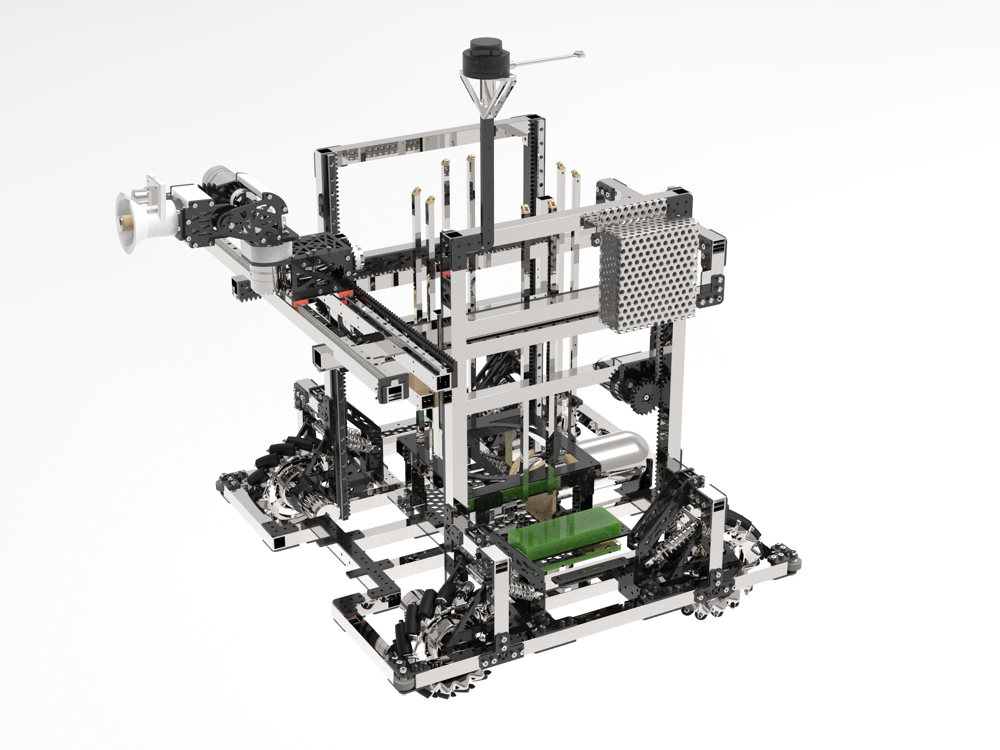
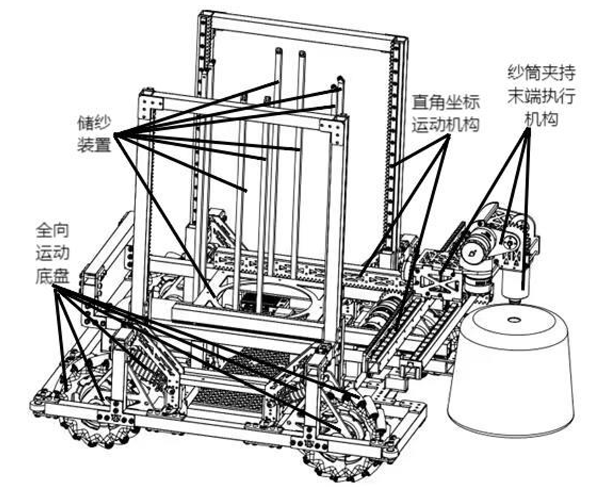
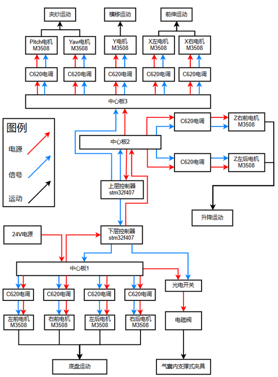

挂纱机器人
============
.. contents:: 目录

挂纱机器人
------------
挂纱机器人，被设计用于纺织车间纱筒的无人搬运与挂放。传统的人工挂纱工艺，工人先将筒纱从仓库取出放置在塑料框中，然后搬运到整经纱架旁，再将筒纱一个个放置到纱架的挂纱杆上。挂纱机器人参考了人工挂纱工艺流程，实现代替人工进行纱筒的自动取放、转运和纱筒上落。

技术方案
----------
机械设计
~~~~~~~~~~
为了实现对任意姿态下纱筒的夹取、储存、运输以及挂纱，根据纱筒及纱架的尺寸，提出了采用全向移动结合直角坐标的运动方式去逼近纱筒进行纱筒的取、运、挂等操作。所设计的挂纱机器人由全向运动底盘、储纱装置、直角坐标运动机构、以及纱筒夹持末端执行机构组成。

全向运动底盘及机架
^^^^^^^^^^^^^^^^^^^
全向运动底盘，由麦克纳姆轮、减震机构以及底盘机架组成。麦克纳姆轮结构紧凑，运动灵活，通过 4个轮组的组合可以实现机器人前行、横移、斜行、旋转等多种运动方式，满足机器人在狭窄的纱架间自由移动的需求，提高工作效率。为了提高机器人的稳定性，设计了弹簧避震机构，在保证机器人基本运动的同时，具有良好的减震和平衡效果。

机架，采用方铝管和玻纤板搭建而成，主要用于连接全向运动底盘、纱筒储存装置、以及固定直角坐标抓取系统。

直角坐标运动机构
^^^^^^^^^^^^^^^^^
前伸机构，为机器人提供X坐标系轴方向的运动。由长度为450mm方管和玻纤齿条组成，齿条模数为2，与方铝管相连，与前伸的齿轮啮合传动。为防止前伸机构运动超限，在合适的位置设置挡块，防止意外发生。

横移机构，为机器人提供Y坐标系轴方向的运动。由长度为600mm的方管、线性导轨、玻纤齿条等构成。齿条模数为2，可使夹纱机构的齿轮与之啮合移动，保证夹纱机构在一定的范围内进行横移运动，为机器人的稳定夹纱作业提供基础保障。横移机构采用双轨四滑块方式，滑块可以更好地固定滑轨的伸缩方向，也可使滑轨保持水平。 

升降机构，为机器人提供Z坐标系轴方向的运动。主体部分由方铝管组成，4个电机分别通过插板式的玻纤板结构固定于方管上，分布在机构四角处竖直方管用于支撑整个升降平台的重量。驱动电机采用对角安装的方式，可提供足够的提升动力，同时对角按照可以使升降机构保持水平不倾斜。

控制系统
~~~~~~~~~~~
控制器选型
^^^^^^^^^^^
选用stm32f4为运动控制主控，负责控制全机的电机运行，接收运动控制指令做出相应动作。

电机选型
^^^^^^^^^
挂纱机器人需要实现全方位的自由移动，末端执行机构的前伸、横移、升降，以及末端夹持机构的两自由度转动，均需要通过电机来进行驱动。为了便于控制，选用GM3508无刷电机，无刷电机具有高效率、低能耗、低噪音、超长寿命、高可靠性、可伺服控制、无级变频调速等优点，且相对低成本且简单易用。

硬件设计
^^^^^^^^^
挂纱机器人的控制系统包括主控板、电池、电机、电调、电源中心板等部分组成。、

软件设计
^^^^^^^^^^
挂纱机器人运动控制依据状态机的程序设计模式。针对机器人的具体状态进行模块化编程控制，主要的运行状态有以下几种：

1.取纱筒 2.存纱筒 3.底盘移动 4.从储存机构中获取纱筒 5.对准纱架并放置纱筒

对每个状态的运动细节分别进行实现，主要的控制思路为：根据上位机的指令，进入不同的状态中，按照设定的流程或上位机提供的数据(在个别状态，如：对准放置纱筒，取纱筒等)对电机进行控制，通过反馈的数据对电机的执行情况进行确认，当电机执行完相应动作后方能进入下一个控制环节，以保证运动的完整性与连贯性。

算法视觉
~~~~~~~~~~
纱筒姿态估计
^^^^^^^^^^^^^^
基于GEN6D的目标姿态检测，采用考虑空间位姿、纱孔位置等多特征融合的视觉检测方法，得到纱筒的姿态，配合电机位置信息可实现任意姿态纱筒夹取控制机制。

定位导航
^^^^^^^^^^^
雷达建图定位，MID360激光雷达配合FAST-LIO算法对周围环境进行建图，扫描得到点云图，与事先导入的点云地图进行匹配，实现挂纱机器人的精确定位。

A*算法路径规划，规划出机器人到达存放纱筒位置的合理路径，反馈相关信息，控制底盘运动到纱筒存放处。

实物效果
----------
.. figure:: images/挂纱机器人3.gif
    :width: 100%